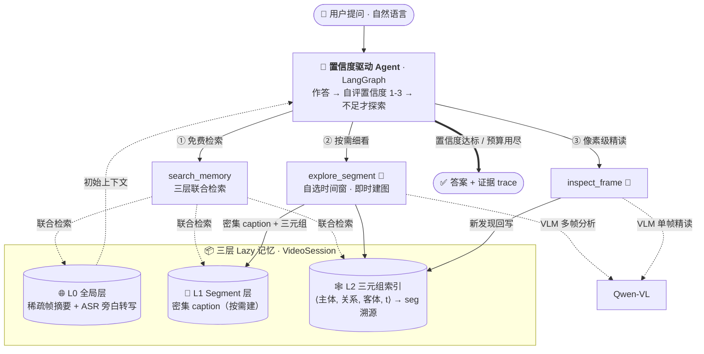

# 🎬 Video Agent

> **一个把视频组织成「Lazy 多粒度记忆」、用置信度驱动按需探索的视频问答 Agent。场景图不再是答案来源，而是多模态证据的时序索引。**


---

## 架构一览（v2）



## 三句话

**做什么**：把一段视频组织成**三层 Lazy 记忆**（全局摘要 + 旁白转写 / 按需细化的段落描述 / 带时间戳的三元组索引），让 Agent 像查档案一样回答关于视频的问题——**不预先全片建图，问到哪里才细看哪里**。

**怎么做**：基于 LangGraph 的 Agent 走**置信度驱动**循环——先免费检索现有记忆并作答，自评置信度 1–3，不足时才自己挑一段视频用 `explore_segment` 细看（即时生成密集描述 + 三元组），轮数与探索次数有上限。场景图被重新定位为**证据的时序索引**（三元组指向它出自的那段完整描述），而非有损的答案压缩。

**结果如何**：在公开长视频基准 **MMBench-Video**（150 题分层子集，**runs=3**）上，v2 **整体反超**直接看帧的 VLM 基线（**1.984±0.101 vs 1.478±0.025**，0–3 分制），且反超在噪声下稳健（差距 0.257 > 双方标准差之和 0.121）；归因干净——旁白模态贡献 +0.249，**架构本身再贡献 +0.257**（同模态公平基线对照）。优势随视频变长单调增强（舒适区边界 ≈90 秒），且**每题只看 3.1 帧** vs 基线固定 8 帧。

> [!IMPORTANT]
> **核心结果（MMBench-Video 150 题 · runs=3 · mean ± std · 已收官）**
>
> | 方法 | 总分 (0–3) | Frames/Q | 说明 |
> |------|-----------|----------|------|
> | **agent_v2** | **1.984 ± 0.101** | **3.1** | Lazy 记忆 + 置信度探索 |
> | vlm_transcript@8 | 1.727 ± 0.020 | 8.0 | 同帧数 + 旁白文字（公平基线） |
> | vlm_direct@8 | 1.478 ± 0.025 | 8.0 | 直接看 8 帧 |
> | agent (v1) | 1.193 | — | 全量预建场景图（旧架构 · runs=1） |
>
> - **反超抗噪成立**：agent_v2 − vlm_transcript = 0.257 > 两者 std 之和 0.121，反超越过噪声带。
> - **归因干净**：ASR 模态 +0.249（vlm_direct→vlm_transcript），架构再 +0.257（同模态对照）——「赢只是因为多了个模态」被数据排除。
> - **舒适区边界 ≈90 秒**：90 秒内基本持平，90 秒以上明显领先（90–180s: 2.10 vs 1.55；>180s: 2.05 vs 1.87）。
> - **幻觉抵抗**：官方 HL 维度 2.422±0.191，是同模态基线的 **2.3×**（vs vlm_direct 约 3.9×）——「答案必须接地到证据」的架构属性。
> - **帧效率**：3.1 帧/题打赢 8 帧/题；150 题中 81 题靠免费检索直答、69 题自主升级探索——按需分配感知预算。
>
> ⚠️ **诚实披露**：judge 为 `qwen-max`（存在 Qwen 评 Qwen 自偏好）；标注审计（n=30）显示 97% gold 被证据支撑，离 3.0 的差距主要是模型能力而非烂标注。论文级 `gpt-4-turbo` 重评待 OpenAI key（已留缓存答案，零额外推理成本）。完整分析见 [`docs/benchmark_mmbv_final_analysis.md`](docs/benchmark_mmbv_final_analysis.md)。

---

## 为什么是 v2？—— 一次诚实的返修

v1 用「时序场景图」做唯一工作记忆（全片预建 → 三元组 → 只查三元组作答）。在真实计费口径下复测，**v1 并没有对直接看帧取得决定性优势**——MMBench-Video 上 1.193 反而输给 vlm_direct 的 1.478。诊断出两个设计错误：

1. **三元组被当成「答案来源」，但它是有损瓶颈**。VLM 看帧时理解的画面文字、属性细节、事件因果，在「只输出 JSON 三元组 + 50 词关系闭表」这一步被丢光。纯三元组 RAG 只保住了直接看帧约一半的可答信号。
2. **全量预建摊不掉**。每视频约 1 题时，开场就把全片建图的成本永远收不回。

对照前沿（VideoAgent / Graph-VideoAgent / DoraemonGPT / Deep Video Discovery / Agentic VLVU）收敛出的共识——**记忆应多粒度且按需构建、caption 必须保留、编排应由置信度驱动**——重写为 v2，于是有了上面的反超。完整演进记录见 [`docs/progress.md`](docs/progress.md)（第十二～十四阶段）。

---

## 核心设计

### 三层 Lazy 记忆

| 层 | 内容 | 何时构建 |
|----|------|---------|
| **L0 全局层** | 稀疏帧（8 帧）全局摘要 + faster-whisper 本地旁白转写 + 时长元信息 | 初始化一次（廉价） |
| **L1 Segment 层** | Agent 选定时间窗 → 窗口内 ≤6 帧 → **密集 caption + 三元组** | **按需**（`explore_segment` 触发） |
| **L2 三元组索引** | `⟨主体, 关系, 客体, t_start, t_end⟩`，每条挂 `seg:<id>` 溯源 | 随 L1 一起写入 |

关键点：**建图本身成了逐题的 Agent 决策**，不再是预处理。检索时三元组命中会**连带返回它出自的那段完整 caption 与旁白片段**——图是目录，证据在 caption 与转写里。

### 置信度驱动编排

Agent 不走固定流水线，而是：① 先用零成本的 `search_memory` 三层联合检索并尝试作答；② 自评置信度 1–3，不足才用 `explore_segment` 挑一段视频细看（每轮 ≤2 次、最多 3 轮）；③ 置信度达标或预算用尽即停。需要画面文字 / 精确计数时才用 `inspect_frame` 做单帧像素级精读。**缺证据时绝不把「图里没有」当成「答案是否」**——必须先探索验证再答。

### 后端抽象

同一套代码、配置一行切换后端：**DashScope 云端**（`qwen-plus` + `qwen-vl-plus`，本项目全部开发与评测的实跑后端）与 **Mock 模式**（无需 API Key，供 CI / 离线开发）。配置走 `configs/default.yaml` + `.env` + 环境变量三级覆盖。代码另预留 **本地 vLLM 后端**接口（`backend: vllm`，目标 `Qwen3-8B` + `Qwen2.5-VL-7B-AWQ`），但因无 GPU 环境**尚未实跑验证**。faster-whisper 在本地转写、零 API 费用，缺失时优雅降级为纯视觉。

---

## 评测方法

- **真实计费口径**：所有 token 来自 API 返回的真实 `usage`（图像 token 含在内），不再用「字符数 ÷3 / 帧数 ×1500」估算——旧的「省 token」卖点经此修正已撤回，详见 [`docs/progress.md`](docs/progress.md) 第十二阶段。
- **官方协议复刻**：MMBench-Video 评分逐字复刻 VLMEvalKit 的 0–3 语义相似度 judge（`src/eval/run_benchmark.py` 的 `mmbv` scorer），judge 端点可经 `JUDGE_*` 环境变量切换（测试用 `qwen-max`，论文换 `gpt-4-turbo`）。
- **公平基线**：`vlm_transcript` = 同帧数 + 旁白文字进 prompt，把「多模态」与「架构」两个变量分开。
- **新指标**：`frames-touched/Q`（每题真正送进视觉模型的帧数），衡量「有指导的感知预算」。

报告：[`docs/benchmark_mmbv_final_analysis.md`](docs/benchmark_mmbv_final_analysis.md)（**runs=3 收官 · 权威结果**） · [`docs/benchmark_mmbv_v2_analysis.md`](docs/benchmark_mmbv_v2_analysis.md)（v2 runs=1 详析） · [`docs/benchmark_mmbv_analysis.md`](docs/benchmark_mmbv_analysis.md)（v1 对照） · [`docs/benchmark_v2_agqa.md`](docs/benchmark_v2_agqa.md)（AGQA 验证门：duration 0.682，5× vlm；总成本 −48%）。

---

## Quick Start

```bash
pip install -r requirements.txt
```

> [!NOTE]
> 当前 `main.py` / Gradio 产品入口仍接的是 v1 Agent；v2 架构（三层 Lazy 记忆 + 置信度循环）目前通过 `src/eval/run_benchmark.py` 的 `agent_v2` 方法跑通与评测，产品入口接线 v2 是进行中的后续工作。

**① Mock 模式** — 无需 API Key，验证流程 / 跑 CI：

```bash
python main.py --video data/videos/cooking.mp4 --question "视频里用了哪几种锅？" --mock
```

**② DashScope 云端模式** — 推荐开发 / macOS，无 GPU 要求：

```bash
cp .env.example .env          # 编辑 .env 填入 DASHSCOPE_API_KEY=sk-xxx
python main.py --video data/videos/cooking.mp4 --question "炒糖色是在放猪肉之前还是之后？"
```

**③ 跑 v2 评测** — 在 MMBench-Video 子集上复现核心结果：

```bash
python -m src.eval.build_mmbench_video --out benchmarks/mmbv_150.json --total 150 --seed 42
JUDGE_MODEL=qwen-max python -m src.eval.run_benchmark \
    --benchmark benchmarks/mmbv_150.json \
    --methods agent_v2,vlm_transcript --vlm-frames 8 \
    --scorers mmbv --answer-mode verbose --runs 3
```

---

## 已知局限性

诚实评估 —— 每条都附改进方向。

| 局限 | 说明 | 改进方向 |
|------|------|---------|
| **judge 为 qwen-max** | runs=3 ±std 已出，但 judge 仍是 qwen-max（存在 Qwen 评 Qwen 自偏好风险） | 换 gpt-4-turbo 对缓存答案重评（脚本就绪，零推理成本，待 OpenAI key） |
| **产品入口未接 v2** | `main.py` / Gradio 仍跑 v1 Agent，v2 目前仅评测路径跑通 | 把 v2 的三层记忆 + 置信度循环移植到产品 Agent |
| **旁白依赖型问题的硬边界** | 「视频里说了什么」类答案在音轨里；纯视觉够不着，TR 维度的增益主要来自 ASR 而非架构 | ASR 已接入 L0；进一步做旁白×画面的时间对齐交叉检索 |
| **置信度判据偶尔过度自信** | 「图里有相关但不充分证据」时会直接作答而不升级探索（AGQA TR 上可见） | 升级判据从「图里有没有」细化为「图能否支撑该题型所需推理」 |
| **关系词表 / 实体去重仍是规则方案** | 50 词关系闭表 + `difflib` 字面相似度去重，长尾会漏 | 数据驱动扩词表；embedding 语义去重 |
| **更长视频（10min+）未测** | 舒适区边界已实测到 ≈90s，但小时级视频上的外推尚无数据 | 接入 LVBench 切片验证斜率交叉 |

---

## Roadmap

按性价比排序，完整分层见 [`docs/progress.md`](docs/progress.md) 第十四阶段末尾。

1. **第二基准复现**（P0）— mmbv 线已收官（runs=3 抗噪成立、便宜杠杆耗尽）；更强证据应在 EgoSchema / Video-MME long 上复现同一反超，而非榨本集残差。
2. **gpt-4-turbo 重评**（P0）— 换 SOTA 可比 judge，零额外推理成本（答案已缓存），待 OpenAI key。
3. **产品入口接线 v2**（P0）— 把三层记忆 + 置信度循环移植到 `main.py` / Gradio。
4. **亮点实验**（P1）— 多轮指代会话（agent 独有的跨问记忆）+ 时序定位精度（图独有的显式时间轴）。
5. **升级判据细化 + 旁白时间对齐**（P2）— 解决过度自信与旁白×画面交叉检索。

---

## 项目结构

```
src/
├── agents/        Agent 工厂（v1 build_agent + v2 build_agent_v2 / 置信度 prompt）
├── tools/         search_memory · explore_segment · inspect_frame（+ v1 四工具）
├── perception/    VLClient（双后端，三层 JSON 容错）· usage 真实计费账本 · asr 本地转写
├── scene_graph/   三元组结构 + 检索器（segment caption + 旁白联合检索）+ 关系词表
├── memory/        VideoSession 跨轮共享状态 + 三层 Lazy 记忆（Segment）
└── eval/          benchmark runner（多方法 / 多 scorer）· MMBench-Video 适配器
frontend/app.py    Gradio UI（Agent trace 流式输出）
benchmarks/        mmbv_150（MMBench-Video 子集）· agqa_en_small 等评测集
configs/default.yaml   统一配置入口
docs/              架构详解 + Phase 12–14 评测报告 + 演进日志
```

技术栈：Python 3.13 · LangChain 1.x / LangGraph · Qwen-VL / Qwen-Plus · faster-whisper · OpenCV · pydantic-settings · Gradio 5.x
