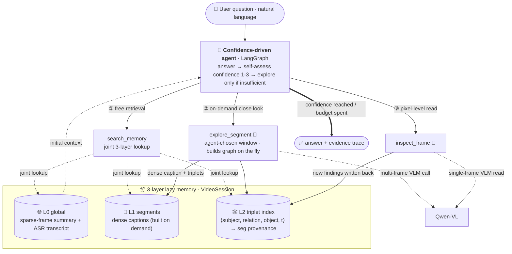

# 🎬 Video Agent

> **A video Q&A agent that organizes a video into lazy, multi-granularity memory and explores on demand, driven by self-assessed confidence. The scene graph is no longer the answer source — it is a temporal index over multimodal evidence.**

**English** | [中文](README.zh.md)


---

## Architecture at a glance (v2)



## In three sentences

**What**: Organize a video into a **3-layer lazy memory** (global summary + narration transcript / on-demand dense segment captions / a timestamped triplet index) so an agent can answer questions about the video the way an archivist consults records — **no upfront full-video graph build; look closely only where the question demands it**.

**How**: A LangGraph agent runs a **confidence-driven loop** — first answer from free retrieval over existing memory, self-assess confidence 1–3, and only when insufficient pick a time window to watch closely with `explore_segment` (generating dense captions + triplets on the fly), under a bounded budget. The scene graph is repositioned as a **temporal index over evidence** (each triplet points back to the full caption it came from), not a lossy compression of answers.

**Result**: On the public long-video benchmark **MMBench-Video** (150-question stratified subset, **runs=3**), v2 **beats the direct-frame VLM baseline overall** (**1.984±0.101 vs 1.478±0.025**, 0–3 scale), and the reversal is robust to noise (gap 0.257 > sum of stds 0.121). Attribution is clean — the narration modality contributes +0.249 and **the architecture itself another +0.257** (same-modality fair baseline). The advantage grows monotonically with video length (comfort-zone boundary ≈90s), while touching only **3.1 frames per question** vs the baseline's fixed 8.

> [!IMPORTANT]
> **Headline results (MMBench-Video, 150 questions · runs=3 · mean ± std · final)**
>
> | Method | Overall (0–3) | Frames/Q | Notes |
> |------|-----------|----------|------|
> | **agent_v2** | **1.984 ± 0.101** | **3.1** | lazy memory + confidence-driven exploration |
> | vlm_transcript@8 | 1.727 ± 0.020 | 8.0 | same frames + narration text (fair baseline) |
> | vlm_direct@8 | 1.478 ± 0.025 | 8.0 | direct 8-frame VLM |
> | agent (v1) | 1.193 | — | full upfront scene-graph build (legacy · runs=1) |
>
> - **Reversal survives noise**: agent_v2 − vlm_transcript = 0.257 > 0.121 (sum of both stds).
> - **Clean attribution**: ASR modality +0.249 (vlm_direct→vlm_transcript), architecture +0.257 on top (same-modality control) — "it only wins because of the extra modality" is ruled out by data.
> - **Comfort-zone boundary ≈90s**: parity under 90s; clear lead beyond it (90–180s: 2.10 vs 1.55; >180s: 2.05 vs 1.87).
> - **Hallucination resistance**: official HL dimension 2.42±0.19 — **2.3×** the same-modality baseline (≈3.9× vs vlm_direct). An architectural property: answers must ground to evidence. (Dimension scores follow the official multi-label `get_dimension_rating` aggregation — see `docs/results/benchmark_mmbv_final_official_agg.md`.)
> - **Frame efficiency**: 3.1 frames/question beats 8; of 150 questions, 81 answered from free retrieval alone, 69 self-escalated to exploration — perception budget allocated on demand.
>
> ✅ **Judge cross-validation**: a full `gpt-4-turbo` re-judge of the cached answers (the official-protocol judge) yields 1.98 / 1.71 / 1.49 — within 0.015 of the `qwen-max` numbers (per-question agreement 0.76–0.81), refuting the Qwen-judging-Qwen self-preference concern; paper-grade numbers use the gpt-4-turbo run ([`docs/results/benchmark_mmbv_final_gpt4judge.md`](docs/results/benchmark_mmbv_final_gpt4judge.md)). An annotation audit (n=30) shows 97% of gold answers are evidence-supported, so the gap to 3.0 is mostly model capability, not label noise. Full analysis: [`docs/analysis/benchmark_mmbv_final_analysis.md`](docs/analysis/benchmark_mmbv_final_analysis.md).

<details>
<summary><b>Per-dimension results</b> — MMBench-Video paper Table-3 layout (gpt-4-turbo judge · official multi-label aggregation · 0–3)</summary>

| Model | Overall | CP | FP-S | FP-C | HL | *P. Mean* | LR | AR | RR | CSR | TR | *R. Mean* |
|-------|------|----|----|----|----|----|----|----|----|----|----|----|
| **agent_v2** | **1.98** | 2.18 | 2.08 | **1.47** | **2.29** | **2.04** | 2.18 | 2.07 | 2.07 | 2.21 | 1.74 | 1.98 |
| vlm_transcript | 1.71 | 1.78 | 1.81 | 0.90 | 0.78 | 1.42 | 1.73 | 2.50 | 2.12 | 2.28 | 1.87 | 2.07 |
| vlm_direct | 1.49 | 1.53 | 1.64 | 0.77 | 0.64 | 1.28 | 1.39 | 2.21 | 1.81 | 2.26 | 1.52 | 1.79 |

The architectural gain concentrates on the **Perception** side (2.04 vs 1.42; guided zoom-in), with hallucination resistance the standout (HL 2.29 vs 0.78, ~2.9×); reasoning dimensions stay near parity since all methods share the same LLM — *this architecture buys seeing accurately, not thinking harder*. ⚠️ 150-question stratified subset (TR/HL oversampled): rows are **not** directly comparable to published full-set (1,998-question) leaderboard numbers. Source: [`docs/results/benchmark_mmbv_final_gpt4judge.md`](docs/results/benchmark_mmbv_final_gpt4judge.md).

</details>

---

## Why v2 — an honest rework

v1 used the temporal scene graph as the *only* working memory (full upfront build → triplets → answer from triplets alone). Re-measured under real API billing, **v1 held no decisive advantage over directly watching frames** — 1.193 on MMBench-Video, losing to vlm_direct's 1.478. Two design errors were diagnosed:

1. **Triplets were treated as the answer source, but they are a lossy bottleneck.** On-screen text, attribute details and event causality that the VLM understands while watching frames were thrown away at the "emit JSON triplets + a 50-word relation vocabulary" step. Pure triplet RAG retained only about half of the answerable signal of direct frame viewing.
2. **A full upfront build never amortizes.** At ~1 question per video, building the whole graph at the start is a cost that is never recovered.

Cross-referencing the consensus that recent agent systems converge on (VideoAgent / Graph-VideoAgent / DoraemonGPT / Deep Video Discovery / agentic VLVU) — **memory should be multi-granular and built on demand, captions must be preserved, orchestration should be confidence-driven** — the system was rewritten as v2, producing the reversal above. Full evolution log: [`docs/progress.md`](docs/progress.md) (Phases 12–14, Chinese).

---

## Core design

### 3-layer lazy memory

| Layer | Contents | Built when |
|----|------|---------|
| **L0 global** | sparse-frame (8) global summary + faster-whisper local narration transcript + duration metadata | once at init (cheap) |
| **L1 segments** | agent-chosen time window → ≤6 frames → **dense caption + triplets** | **on demand** (`explore_segment`) |
| **L2 triplet index** | `⟨subject, relation, object, t_start, t_end⟩`, each carrying `seg:<id>` provenance | written together with L1 |

Key point: **graph construction became a per-question agent decision**, not preprocessing. At retrieval time a triplet hit **pulls back the full caption and transcript window it came from** — the graph is the catalog; the evidence lives in captions and the transcript.

### Confidence-driven orchestration

Instead of a fixed pipeline the agent: ① answers from the zero-cost `search_memory` joint lookup first; ② self-assesses confidence 1–3, and only if insufficient picks a video window to explore with `explore_segment` (≤2 per round, ≤3 rounds); ③ stops as soon as confidence is reached or the budget is spent. `inspect_frame` handles pixel-level needs (on-screen text, exact counting). **Absence of evidence is never treated as "no"** — the agent must verify by exploring before answering negatively.

### Backend abstraction

One codebase, one config line to switch backends: **DashScope cloud** (`qwen-plus` + `qwen-vl-plus`, the backend all development and evaluation actually ran on) and a **mock mode** (no API key, for CI / offline development). Config resolves through `configs/default.yaml` + `.env` + environment variables. A **local vLLM backend** interface is reserved (`backend: vllm`, targeting `Qwen3-8B` + `Qwen2.5-VL-7B-AWQ`) but **not yet verified on real hardware** (no GPU environment). faster-whisper transcribes locally at zero API cost and degrades gracefully to vision-only when absent.

---

## Evaluation methodology

- **Real billing**: every token count comes from the API's actual `usage` (image tokens included) — no character/frame estimation. The earlier "token savings" claim was retracted after this correction; see [`docs/progress.md`](docs/progress.md) Phase 12.
- **Official protocol replication**: MMBench-Video scoring replicates VLMEvalKit's 0–3 semantic judge verbatim (`mmbv` scorer in `src/eval/run_benchmark.py`); the judge endpoint switches via `JUDGE_*` env vars (`qwen-max` for testing, `gpt-4-turbo` for the paper).
- **Fair baseline**: `vlm_transcript` = same frame count + narration text in the prompt, separating the "extra modality" variable from the "architecture" variable.
- **New metric**: `frames-touched/Q` — frames actually sent to the vision model per question, measuring guided perception budget.

Reports: [`docs/analysis/benchmark_mmbv_final_analysis.md`](docs/analysis/benchmark_mmbv_final_analysis.md) (**runs=3, authoritative**) · [`docs/archive/benchmark_mmbv_v2_analysis.md`](docs/archive/benchmark_mmbv_v2_analysis.md) (v2 runs=1 detail) · [`docs/results/benchmark_v2_agqa.md`](docs/results/benchmark_v2_agqa.md) (AGQA gate: duration 0.682, 5× vlm).

---

## Quick Start

```bash
pip install -r requirements.txt
```

**① Mock mode** — no API key; verifies the full loop / used by CI:

```bash
python main.py --video data/videos/cooking.mp4 --question "What cookware is used?" --mock
```

**② DashScope cloud mode** — recommended for development on macOS, no GPU required:

```bash
cp .env.example .env          # put DASHSCOPE_API_KEY=sk-xxx in .env
python main.py --video data/videos/cooking.mp4 --question "Is the sugar added before or after the pork?"
```

`main.py` (single-question + interactive) runs the **v2 agent** on the real backend; `--mock` runs the v1 scripted offline mock.

**③ REST API service** — the same v2 agent behind FastAPI (session memory persists across questions):

```bash
uvicorn src.api.app:app --port 8000

# create a session (runs L0 prep: summary + transcript)
curl -X POST localhost:8000/sessions -H 'Content-Type: application/json' \
     -d '{"video_path": "data/videos/cooking.mp4"}'
# ask (returns answer + tool trace; use /ask/stream for SSE streaming)
curl -X POST localhost:8000/sessions/<session_id>/ask \
     -H 'Content-Type: application/json' -d '{"question": "What is cooked first?"}'
```

**④ Docker** — slim service image (mock mode needs no key):

```bash
docker build -t video-agent .
docker run --rm -p 8000:8000 --env-file .env -v "$PWD/data:/app/data" video-agent
```

**⑤ Reproduce the headline result** on the MMBench-Video subset:

```bash
python -m src.eval.build_mmbench_video --out benchmarks/mmbv_150.json --total 150 --seed 42
JUDGE_MODEL=qwen-max python -m src.eval.run_benchmark \
    --benchmark benchmarks/mmbv_150.json \
    --methods agent_v2,vlm_transcript --vlm-frames 8 \
    --scorers mmbv --answer-mode verbose --runs 3
```

---

## Known limitations

Honest assessment — each with its improvement path.

| Limitation | Detail | Path |
|------|------|---------|
| ~~Judge is qwen-max~~ | ✅ Resolved (2026-07-17): full gpt-4-turbo re-judge, totals within 0.015, agreement 0.76–0.81 — self-preference refuted | Paper numbers use the gpt-4-turbo run (`docs/results/benchmark_mmbv_final_gpt4judge.md`) |
| **Gradio frontend not on v2** | `main.py` and the API run v2; the Gradio UI still drives v1 and is stale | port the frontend to the v2 path, or treat CLI/API as the product entry |
| **Hard boundary on narration-dependent questions** | "what did they say" answers live in the audio track; TR-dimension gains come mostly from ASR, not architecture | ASR is in L0; next is time-aligned cross-retrieval of narration × visuals |
| **Confidence self-assessment is occasionally overconfident** | "related but insufficient evidence in the graph" can trigger a direct answer instead of escalation | refine the criterion from "is there related evidence" to "does the evidence support this question type's reasoning" |
| **Relation vocab / entity dedup are rule-based** | 50-word closed relation set + string-similarity dedup; long-tail slips through | data-driven vocabulary growth; embedding-based semantic dedup |
| **Videos >10min untested** | comfort-zone boundary measured to ≈90s; hour-scale extrapolation has no data | LVBench slices to verify the slope crossing |

---

## Roadmap

Ordered by return on effort; full tiering in [`docs/progress.md`](docs/progress.md) (Phase 14).

1. **Second-benchmark reproduction** (P0) — the mmbv line is closed (runs=3 noise-robust, cheap levers exhausted); stronger evidence means reproducing the same reversal on EgoSchema / Video-MME long, not squeezing this subset.
2. ~~**gpt-4-turbo re-judge** (P0)~~ — ✅ Done (2026-07-17): official-protocol judge confirms all conclusions (totals within 0.015); see `docs/results/benchmark_mmbv_final_gpt4judge.md`.
3. **Highlight experiments** (P1) — multi-turn reference resolution (agent-only cross-question memory) + temporal localization precision (graph-only explicit timeline).
4. **Confidence criterion refinement + narration-visual time alignment** (P2).

---

## Project structure

```
src/
├── agents/        agent factories (v1 build_agent + v2 build_agent_v2 / confidence prompts / shared runtime helpers)
├── api/           FastAPI service (sessions, ask, SSE streaming trace)
├── tools/         search_memory · explore_segment · inspect_frame (+ 4 v1 tools)
├── perception/    VLClient (dual backend, 3-level JSON tolerance) · real-usage ledger · local ASR
├── scene_graph/   triplet structures + retriever (segment captions + transcript joint lookup) + relation vocab
├── memory/        VideoSession cross-turn shared state + 3-layer lazy memory
└── eval/          benchmark runner (multi-method / multi-scorer) · MMBench-Video adapter
main.py            CLI entry (single question / interactive / --mock)
frontend/app.py    Gradio UI (v1, stale — see limitations)
benchmarks/        mmbv_150 (MMBench-Video subset) · agqa_en_small
configs/default.yaml   unified config entry
docs/              architecture, evaluation reports, evolution log (Chinese)
```

Stack: Python 3.13 · LangChain 1.x / LangGraph · Qwen-VL / Qwen-Plus · faster-whisper · OpenCV · pydantic-settings · FastAPI · Gradio 5.x
