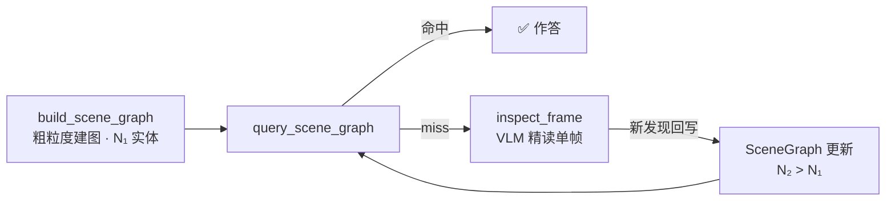

# 🎬 Video Agent

> **一个用「时序场景图」做结构化工作记忆的 ReAct Agent，回答关于视频内容的中文自然语言问题。**


---

## 架构一览


## 三句话

**做什么**：把一段视频压缩成带时间戳的「时序场景图」（三元组 `⟨主体, 关系, 客体, t_start, t_end⟩`），作为 Agent 的结构化工作记忆，回答关于视频的中文问题。

**怎么做**：基于 LangGraph 的 ReAct Agent 按需调度四个工具——*抽帧 → 建图 → 检索 → 精读*；其中 `inspect_frame` 把 VLM 的单帧精读发现**反向写回**场景图，形成「检索→精读→更新→再检索」的渐进式精化闭环。

**结果如何**：在自建中文视频 QA 评测集上做了 3 方案 × 3 轮的对照实验。公平评测下 Agent 整体准确率（0.313）略低于「VLM 直推」基线（0.373），但**单题 token 开销仅为其约 1/4**；结构化记忆的价值集中在需要跨帧聚合的**计数类**问题（Agent 唯一明确领先的赛道）。

> [!IMPORTANT]
> **核心结果** — 在消除「读字幕作弊」干扰变量的公平评测下（`cooking.mp4`，25 题 × 3 轮）：
> Agent 整体准确率 **0.313 ± 0.019**，低于直接视觉感知基线 vlm_direct 的 **0.373 ± 0.009**——
> 「看到了什么」类问题（物体识别、实体属性）直接看帧更强。
> Agent 的真实优势是**成本**：**单题 token 开销仅为 vlm_direct 的 ~23%**（1,383 vs 6,039 tokens/题），
> 且在需要跨帧聚合的**计数类**上是唯一明确领先者（0.133 vs 0.000）。
> 确定性解码后 Agent 方差从 ±0.100 降至 **±0.019**。
>
> ⚠️ 早期版本曾宣称「关系推理 2.7×、整体持平」——该结论源自评测脚本的一处缺陷
> （`vlm_direct` 抽帧耦合了 Agent 侧配置）。修正后 `vlm_direct` 重测，关系推理实为**持平**
> （0.267 vs 0.267）、整体由其领先。详见 [`docs/progress.md`](docs/progress.md) 第十阶段。

---

## 核心设计

### 四个工具的协作

Agent 不走固定流水线，而是按问题难度动态决策：先用 `extract_keyframes` 抽帧并缓存，再用 `build_scene_graph` 批量调用 VLM 把帧理解成三元组写入场景图；回答时**优先**调用零成本的 `query_scene_graph`（jieba 中文多策略检索）；只有当图检索 miss 或需要像素级细节时，才调用昂贵的 `inspect_frame` 做单帧 VLM 精读。这样「能查图就不看帧」，把 VLM 调用花在刀刃上。

### 渐进式精化（Progressive Refinement）

`inspect_frame` 的每次精读发现都会**自动反向写入** `VideoSession.scene_graph`，因此后续所有 `query_scene_graph` 都能查到新内容——场景图在对话过程中越用越完整，而不是一次建好就固定。



### 双后端部署

同一套代码，配置一行切换三种运行模式：**DashScope 云端**（`qwen-plus-latest` + `qwen-vl-plus-latest`，开发 / 无 GPU 的 macOS）、**本地 vLLM**（单卡 RTX 4090 上跑 `Qwen3-8B` + `Qwen2.5-VL-7B-AWQ`，AWQ 量化让两个模型共存于 24GB 显存）、**Mock 模式**（无需 API Key，造假三元组，供 CI / 离线开发）。配置走 `configs/default.yaml` + `.env` + 环境变量三级覆盖。

---

## 评测结果

3 个方案做对照：**agent**（完整 ReAct + 动态场景图）、**rag_only**（预建静态场景图，纯文本 RAG，无视觉工具）、**vlm_direct**（每题抽 4 帧均匀覆盖全片直接喂 VLM，无场景图）。评分用 `qwen-plus-latest` 做 LLM-as-Judge，按 `key_facts` 命中情况打 0 / 0.5 / 1。

### 两个视频的对比

| 视频 | 评测集 | agent | rag_only | vlm_direct |
|------|--------|-------|----------|------------|
| `test1.mp4`（游戏录屏，14s） | v1 · 25 题 × 1 轮 | 0.360 | 0.340 | **0.540** |
| `cooking.mp4`（红烧肉教程，202s） | v2 · 25 题 × 3 轮 | 0.313 ±0.019 | 0.040 ±0.033 | **0.373** ±0.009 |

> **为什么换视频？** `test1.mp4` 是游戏录屏，画面 UI 上有可直读的队伍名 / 角色名——`vlm_direct` 靠「读字」就能赢，这是一个**混杂变量**。换成 `cooking.mp4`（字幕为喜剧风格，不含食谱信息）后，`vlm_direct` 从 0.540 跌到 0.373，Agent 与它的差距从 0.180 缩小到 0.060。**评测设计本身要先排除作弊路径。**

### 分类成绩（`cooking.mp4`）

| 分类 | agent | rag_only | vlm_direct | |
|------|-------|----------|------------|---|
| 物体识别 | 0.367 | 0.067 | **0.600** | VLM 直推明显胜出 |
| 实体属性 | 0.333 | 0.033 | **0.500** | VLM 直推胜出 |
| 关系推理 | 0.267 | 0.067 | 0.267 | 持平 |
| 时序推理 | 0.467 | 0.000 | **0.500** | VLM 直推略胜 |
| 计数/出现 | **0.133** | 0.033 | 0.000 | ✅ Agent 唯一明确领先 |

**结论**：在公平评测下，直接视觉感知（vlm_direct）在「看到了什么」类问题（物体识别、实体属性）上明显更强，整体准确率也更高。场景图作为结构化记忆的价值集中在 **计数 / 出现** 这类需要跨帧聚合去重的问题——Agent 是唯一明确领先的方案；关系推理与 vlm_direct 持平。Agent 的核心卖点不是准确率，而是**以 ~1/4 的 token 开销（1,383 vs 6,039 tokens/题）换取相近量级的整体表现**。

> ⚠️ 单类别仅 5 题，分类成绩方差大（如物体识别 agent std ±0.125），分类层面的胜负**不具统计显著性**，仅作定性参考；可靠的结论是整体准确率与 token 成本。
>
> 完整报告：[`docs/benchmark_final.md`](docs/benchmark_final.md)（含 2026-05-17 vlm_direct 重测说明） · [`docs/benchmark_v2_analysis.md`](docs/benchmark_v2_analysis.md)（Phase 7 历史分析，数值为修正前快照）

---

## Quick Start

```bash
pip install -r requirements.txt
```

**① Mock 模式** — 无需 API Key，造假三元组，验证流程 / 跑 CI：

```bash
python main.py --video data/videos/cooking.mp4 --question "视频里用了哪几种锅？" --mock
```

**② DashScope 云端模式** — 推荐开发 / macOS，无 GPU 要求：

```bash
cp .env.example .env          # 编辑 .env 填入 DASHSCOPE_API_KEY=sk-xxx
python main.py --video data/videos/cooking.mp4 --question "炒糖色是在放猪肉之前还是之后？"
```

**③ 本地 vLLM 模式** — 生产 / GPU 服务器（单卡 RTX 4090）：

```bash
# Terminal 1 — Agent 大脑
vllm serve Qwen/Qwen3-8B --port 8000
# Terminal 2 — 视觉模型
vllm serve Qwen/Qwen2.5-VL-7B-Instruct-AWQ --port 8001
# Terminal 3
python main.py --video data/videos/cooking.mp4 --question "..." --backend vllm
```

其他入口：`python main.py --video ... --interactive`（多轮对话，跨轮复用场景图）、`python frontend/app.py`（Gradio UI，端口 7860，右栏实时流式展示 Agent 推理 trace）。

---

## 已知局限性

诚实评估 —— 每条都附带改进方向。

| 局限 | 说明 | 改进方向 |
|------|------|---------|
| **评测集规模小** | 每个视频仅 25 题（v1 + v2 共 50 题），每题权重 4%，统计显著性有限 | 接入公开数据集 NExT-QA / ActivityNet-QA，扩展到 100+ 题 |
| **关系词表覆盖不全** | `relation_vocab.py` 仅 50 个中文关系动词，长尾关系（罕见动词）会被检索漏掉 | 数据驱动扩展词表；或改用 embedding 语义匹配替代固定词表 |
| **实体去重是规则方案** | 跨批次实体合并用 `difflib.SequenceMatcher` 字面相似度（阈值 0.85），存在假阳性 / 假阴性，鲁棒性有限 | 改用 sentence-transformers 语义相似度去重 |
| **整体准确率不及 VLM 直推** | 公平评测下 vlm_direct 整体领先（0.373 vs 0.313），物体识别 / 实体属性 / 时序推理均胜出——建图过程有信息损失，Agent 准确率上限受场景图质量制约 | 优化 `build_scene_graph` 针对动作类视频的提取 prompt（场景图实体 25→40+）；Agent 当前明确的价值是 ~1/4 的 token 成本与计数类领先 |
| **评测脚本曾有交叉污染** | `vlm_direct` 曾从 Agent 预构建帧缓存取帧，输入隐式耦合 `keyframe_count`；早期「关系推理 2.7×」结论即此缺陷所致 | 已修复（见 `docs/progress.md` 第十阶段）：`vlm_direct` 改为独立抽帧 + 过采样均匀覆盖全片 |

---

## Roadmap

1. **语义检索** — 用 FAISS + sentence-transformers embedding 替代 jieba 规则匹配，解决「焯水 ≠ 预处理」「人物 ≠ 具体角色名」这类近义词 / 类别-实例 miss。
2. **公开 benchmark** — 接入 NExT-QA / ActivityNet-QA，用标准数据集获得有统计意义的对比结果。
3. **时序事件日志工具** — 针对当前时序推理短板，新增按时间轴组织的事件序列工具，补齐对「先后顺序」类问题的表达能力。
4. **多 Agent 协作** — 拆分为「规划 Agent + 感知 Agent」，规划者分解问题、感知者负责取证，提升复杂多跳问题的成功率。
5. **动作类视频建图优化** — `build_scene_graph` prompt 增加「烹饪动作 → 食材转移 → 容器变化 → 火候」专项提取，预期场景图实体数 25 → 40+。

---

## 项目结构

```
src/
├── agents/        ReAct Agent 工厂 + 中文系统 prompt
├── tools/         四个 LangChain 工具
├── perception/    VLClient（DashScope / vLLM 双后端，三层 JSON 容错解析）
├── scene_graph/   三元组数据结构 + jieba 多策略检索器 + 关系词表
├── memory/        VideoSession 跨轮共享状态
└── eval/          benchmark runner + LLM-as-Judge
frontend/app.py    Gradio UI（三栏，Agent trace 流式输出）
benchmarks/        cn_video_qa_v1/v2.json 自建中文评测集
configs/default.yaml   统一配置入口
docs/              架构详解 + 各阶段评测报告 + 演进日志
```

技术栈：Python 3.13 · LangChain 1.x / LangGraph · Qwen-VL / Qwen-Plus · OpenCV · pydantic-settings · jieba · Gradio 5.x
