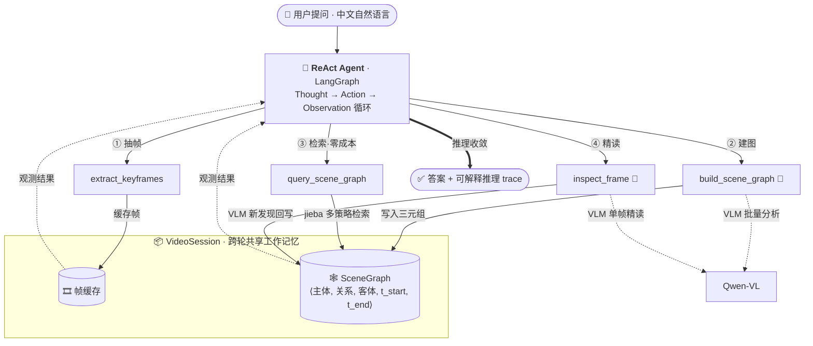
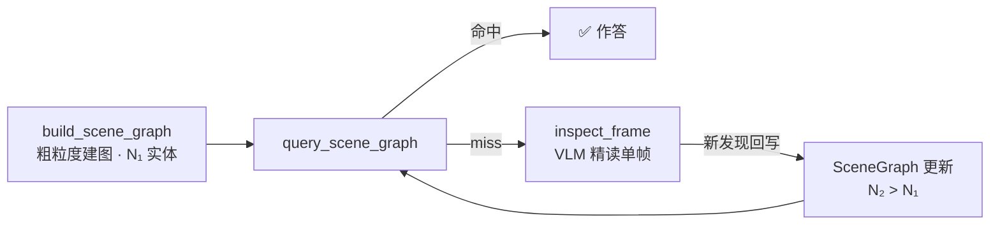

# 🎬 Video Agent

> **一个用「时序场景图」做结构化工作记忆的 ReAct Agent，回答关于视频内容的中文自然语言问题。**


---

## 架构一览



## 三句话

**做什么**：把一段视频压缩成带时间戳的「时序场景图」（三元组 `⟨主体, 关系, 客体, t_start, t_end⟩`），作为 Agent 的结构化工作记忆，回答关于视频的中文问题。

**怎么做**：基于 LangGraph 的 ReAct Agent 按需调度四个工具——*抽帧 → 建图 → 检索 → 精读*；其中 `inspect_frame` 把 VLM 的单帧精读发现**反向写回**场景图，形成「检索→精读→更新→再检索」的渐进式精化闭环。

**结果如何**：在**两个数据集**上做了 3 方案 × 3 轮对照——自建 `cooking.mp4`(25 题) + **公开 AGQA Charades**(10 视频 / 70 题)。两个数据集呈现 **Pareto 互补**:在 AGQA 上 Agent **整体反超** vlm_direct(**0.364 vs 0.326**)且 token 开销仅为其 ~23%(1,368 vs 6,041),胜负在 `duration` 类问题(2.1× 领先)——三元组的 `t_start/t_end` 是 vlm_direct 没有的能力;在 cooking 上 vlm_direct 整体领先(0.373 vs 0.313),「看到了什么」类直接看帧更强。Agent 的核心定位是 **结构化时间推理 + token 效率**,不是单帧感知最优。

> [!IMPORTANT]
> **核心结果(两个数据集互补,讲完整故事)**
>
> **公开数据集 AGQA Charades**(10 视频 × 70 题 × 3 轮)—— Agent **整体反超**:
> Agent **0.364 ± 0.015** vs vlm_direct **0.326 ± 0.007**,且 token 开销仅其 **~23%**(1,368 vs 6,041)。胜负主要在 `duration`(0.318 vs 0.152, **2.1×**)——三元组的 `t_start/t_end` 是直接视觉感知没有的能力。
>
> **自建 `cooking.mp4`**(25 题 × 3 轮,消除字幕作弊后)—— vlm_direct 整体领先:
> Agent **0.313 ± 0.019** vs vlm_direct **0.373 ± 0.009**。「看到了什么」(物体识别、实体属性)直接看帧更强;Agent 在跨帧聚合的「计数 / 出现」类唯一明确领先(0.133 vs 0.000)。
>
> **整合结论 — Pareto 互补**:Agent 在 **结构化时间** + **跨帧聚合** + **token 成本** 三方面有可量化优势;不在「单帧 dense perception」(物体识别 / 属性)。
>
> ⚠️ 评测设计上的两处**诚实修正**:① Phase 10 cooking 时早期版本曾因 `vlm_direct` 抽帧耦合 Agent 配置而误报「关系推理 2.7×」,修正后 vlm_direct 重测、整体反超 agent;② Phase 11 跑 AGQA 前预测「短视频会让 agent 输」,实测打脸 agent 反胜——两次都把诚实数据写进了 [`docs/progress.md`](docs/progress.md)(第十、第十一阶段)。完整报告:[`docs/benchmark_agqa.md`](docs/benchmark_agqa.md) · [`docs/benchmark_final.md`](docs/benchmark_final.md)。

---

## 核心设计

### 四个工具的协作

Agent 不走固定流水线，而是按问题难度动态决策：先用 `extract_keyframes` 抽帧并缓存，再用 `build_scene_graph` 批量调用 VLM 把帧理解成三元组写入场景图；回答时**优先**调用零成本的 `query_scene_graph`（jieba 中文多策略检索）；只有当图检索 miss 或需要像素级细节时，才调用昂贵的 `inspect_frame` 做单帧 VLM 精读。这样「能查图就不看帧」，把 VLM 调用花在刀刃上。

### 渐进式精化（Progressive Refinement）

`inspect_frame` 的每次精读发现都会**自动反向写入** `VideoSession.scene_graph`，因此后续所有 `query_scene_graph` 都能查到新内容——场景图在对话过程中越用越完整，而不是一次建好就固定。



### 双后端部署

同一套代码，配置一行切换三种运行模式：**DashScope 云端**（`qwen-plus-latest` + `qwen-vl-plus-latest`，开发 / 无 GPU 的 macOS）、**本地 vLLM**（单卡 RTX 4090 上跑 `Qwen3-8B` + `Qwen2.5-VL-7B-AWQ`，AWQ 量化让两个模型共存于 24GB 显存）、**Mock 模式**（无需 API Key，造假三元组，供 CI / 离线开发）。配置走 `configs/default.yaml` + `.env` + 环境变量三级覆盖。

---

## 评测结果

3 方案对照:**agent**(完整 ReAct + 动态场景图)、**rag_only**(预建静态场景图,纯文本 RAG)、**vlm_direct**(每题抽 4 帧均匀覆盖全片直推 VLM,无场景图)。LLM-as-Judge 由 `qwen-plus-latest` 按 `key_facts` 打 0 / 0.5 / 1。

### 公开数据集:AGQA Charades(10 视频 × 70 题 × 3 轮)

题目来自 [AGQA 2.0 balanced](https://cs.stanford.edu/people/ranjaykrishna/agqa/)(Stanford 出品),视频来自 Charades。AGQA 问题是从 Action Genome 的**时空场景图**自动生成的——**主题与本项目高度契合**(题目正是问"时空关系")。英文 QA 由 LLM 翻译成中文(三轮 prompt 迭代修复了子句丢失 / 词义错 / Q/A 不一致),启发式分类成 binary / duration / sequencing / open 四类。

| 方法 | 整体准确率 | Avg Tool Calls | Avg Time | Tokens/Q |
|------|-----------|---------------|----------|----------|
| **agent** | **0.364 ± 0.015** | 4.5 | 24.4s | **1,368** |
| rag_only | 0.186 ± 0.031 | — | 4.0s | 838 |
| vlm_direct | 0.326 ± 0.007 | — | 4.5s | 6,041 |

**分类成绩** — Agent 的优势全在「结构化时间窗」相关赛道:

| 分类 | agent | vlm_direct | |
|------|-------|-----------|---|
| **duration**(时长)| **0.318** | 0.152 | ✅ Agent **2.1×** — 三元组 `t_start/t_end` 直接答时长 |
| **binary**(二元判断)| **0.514** | 0.444 | ✅ Agent 略胜 — 结构化 exists 判定 |
| sequencing(先后顺序)| 0.381 | **0.452** | VLM 赢 0.07 — `merge_window_sec=3.0` 在 30s 短视频精度不够 |
| open(开放问答)| 0.206 | 0.198 | 持平 |

完整报告:[`docs/benchmark_agqa.md`](docs/benchmark_agqa.md)

### 自建评测集(消除字幕作弊后的公平基线)

| 视频 | 评测集 | agent | rag_only | vlm_direct |
|------|--------|-------|----------|------------|
| `test1.mp4`(游戏录屏 14s) | v1 · 25 题 × 1 轮 | 0.360 | 0.340 | **0.540** |
| `cooking.mp4`(红烧肉教程 202s) | v2 · 25 题 × 3 轮 | 0.313 ±0.019 | 0.040 ±0.033 | **0.373** ±0.009 |

> **为什么从 test1 换到 cooking?** `test1.mp4` 是游戏录屏,画面 UI 上有可直读的队伍名 / 角色名——`vlm_direct` 靠「读字」就能赢,这是**混杂变量**。换成 `cooking.mp4`(字幕为喜剧风格,不含食谱信息)后,`vlm_direct` 从 0.540 跌到 0.373,Agent 与它的差距从 0.180 缩小到 0.060。**评测设计本身要先排除作弊路径**——这种修正是项目方法论上的核心动作。

**cooking 分类成绩**:

| 分类 | agent | rag_only | vlm_direct | |
|------|-------|----------|------------|---|
| 物体识别 | 0.367 | 0.067 | **0.600** | VLM 直推明显胜出 |
| 实体属性 | 0.333 | 0.033 | **0.500** | VLM 直推胜出 |
| 关系推理 | 0.267 | 0.067 | 0.267 | 持平 |
| 时序推理 | 0.467 | 0.000 | **0.500** | VLM 直推略胜 |
| 计数/出现 | **0.133** | 0.033 | 0.000 | ✅ Agent 唯一明确领先 |

完整报告:[`docs/benchmark_final.md`](docs/benchmark_final.md)(含 2026-05-17 vlm_direct 重测说明)

### Pareto 互补:两个数据集整合结论

- **Agent 赢的赛道**:AGQA 整体 / AGQA duration(2.1×) / cooking 计数;**token 成本始终 ~1/4 vlm_direct**(两个数据集都一致)
- **vlm_direct 赢的赛道**:cooking 物体识别 / 实体属性(直接看帧的舒适区)、AGQA sequencing(短视频时序连贯性 vlm 更强)
- **Agent 的核心定位**:**结构化时间推理 + 跨帧聚合 + token 效率**,不在「单帧 dense perception」

> ⚠️ 单类别样本量有限(cooking 每类 5 题、AGQA 每类 11–24 题),分类层面胜负仅作**定性参考**;可靠结论是**整体准确率 + token 成本**(两个数据集都一致显示 Agent 占 token 优势 4–5×)。

---

## Quick Start

```bash
pip install -r requirements.txt
```

**① Mock 模式** — 无需 API Key，造假三元组，验证流程 / 跑 CI：

```bash
python main.py --video data/videos/cooking.mp4 --question "视频里用了哪几种锅？" --mock
```

**② DashScope 云端模式** — 推荐开发 / macOS，无 GPU 要求：

```bash
cp .env.example .env          # 编辑 .env 填入 DASHSCOPE_API_KEY=sk-xxx
python main.py --video data/videos/cooking.mp4 --question "炒糖色是在放猪肉之前还是之后？"
```

**③ 本地 vLLM 模式** — 生产 / GPU 服务器（单卡 RTX 4090）：

```bash
# Terminal 1 — Agent 大脑
vllm serve Qwen/Qwen3-8B --port 8000
# Terminal 2 — 视觉模型
vllm serve Qwen/Qwen2.5-VL-7B-Instruct-AWQ --port 8001
# Terminal 3
python main.py --video data/videos/cooking.mp4 --question "..." --backend vllm
```

其他入口：`python main.py --video ... --interactive`（多轮对话，跨轮复用场景图）、`python frontend/app.py`（Gradio UI，端口 7860，右栏实时流式展示 Agent 推理 trace）。

---

## 已知局限性

诚实评估 —— 每条都附带改进方向。

| 局限 | 说明 | 改进方向 |
|------|------|---------|
| **评测集规模仍可扩** | 已接入公开 AGQA(70 题, 4 类)+ 自建 cooking(25 题, 5 类),共 95 题;但单类别样本量(AGQA 11–24 / cooking 5)仍偏小,分类胜负不具统计显著性 | 扩 AGQA 抽样到 200+ 题, 或接入第二个公开数据集 |
| **Charades 短视频(~30s)抹掉 amortize 优势** | Agent「一次建图 / 多题复用」的成本优势在 30s 视频上不够明显;AGQA sequencing 类输给 vlm 0.07(`merge_window_sec=3.0` 时间精度不足) | 调小 merge window 或加事件时间线工具;接入 ActivityNet-QA / Video-MME 长视频(3 分钟+)让 Pareto 真正分离 |
| **关系词表覆盖不全** | `relation_vocab.py` 仅 50 个中文关系动词,长尾关系(罕见动词)会被检索漏掉 | 数据驱动扩展词表;或改用 embedding 语义匹配替代固定词表 |
| **实体去重是规则方案** | 跨批次实体合并用 `difflib.SequenceMatcher` 字面相似度(阈值 0.85),存在假阳性 / 假阴性,鲁棒性有限 | 改用 sentence-transformers 语义相似度去重 |
| **单帧 dense perception 不如 vlm_direct** | cooking 上 vlm_direct 物体识别 / 实体属性领先;建图过程有信息损失,Agent 这一类准确率上限受场景图质量制约 | 优化 `build_scene_graph` 针对动作类视频的提取 prompt;Agent 的定位本就不在这一类 |
| **评测脚本曾有交叉污染** | `vlm_direct` 曾从 Agent 预构建帧缓存取帧,输入隐式耦合 `keyframe_count`;早期「关系推理 2.7×」结论即此缺陷所致 | 已修复(见 `docs/progress.md` 第十阶段):`vlm_direct` 改为独立抽帧 + 过采样均匀覆盖全片 |

---

## Roadmap

按性价比排序(数据已经指明痛点的先做)。完整的 P0/P1/P2 分层与「下一步建议」见 [`docs/progress.md`](docs/progress.md) Phase 11 末尾。

1. **时序窗口精度优化**(P0) — AGQA sequencing 输 vlm 0.07,`merge_window_sec=3.0` 在 30s 视频精度不够;先把 window 调到 1.0 重跑,无论涨跌都是有效数据点。
2. **`build_scene_graph` 鲁棒性 + 动作类专项 prompt**(P0) — 单视频极差 7.5×(03PRW 0.095 vs 00607 0.714)+ cooking dense perception 输给 vlm;先审最差视频实际抽出了什么,再写「动作 → 食材 → 容器」专项 prompt。
3. **跨数据集 / 长视频 benchmark**(P1) — 接第二个公开数据集证普适性,接 ActivityNet-QA / Video-MME(3 分钟+)让 Pareto 真正分离——AGQA Charades 是 vlm 的舒适区。
4. **语义检索**(P1) — FAISS + sentence-transformers 替代 jieba,解决「焯水 ≠ 预处理」「人物 ≠ 具体角色名」近义词 / 类别-实例 miss;同时升级关系词表和实体去重。
5. **多 Agent 协作**(P2,长期) — 拆分为「规划 Agent + 感知 Agent」,提升复杂多跳问题的成功率。

---

## 项目结构

```
src/
├── agents/        ReAct Agent 工厂 + 中文系统 prompt
├── tools/         四个 LangChain 工具
├── perception/    VLClient（DashScope / vLLM 双后端，三层 JSON 容错解析）
├── scene_graph/   三元组数据结构 + jieba 多策略检索器 + 关系词表
├── memory/        VideoSession 跨轮共享状态
└── eval/          benchmark runner + LLM-as-Judge
frontend/app.py    Gradio UI（三栏，Agent trace 流式输出）
benchmarks/        cn_video_qa_v1/v2.json 自建中文评测集
configs/default.yaml   统一配置入口
docs/              架构详解 + 各阶段评测报告 + 演进日志
```

技术栈：Python 3.13 · LangChain 1.x / LangGraph · Qwen-VL / Qwen-Plus · OpenCV · pydantic-settings · jieba · Gradio 5.x
