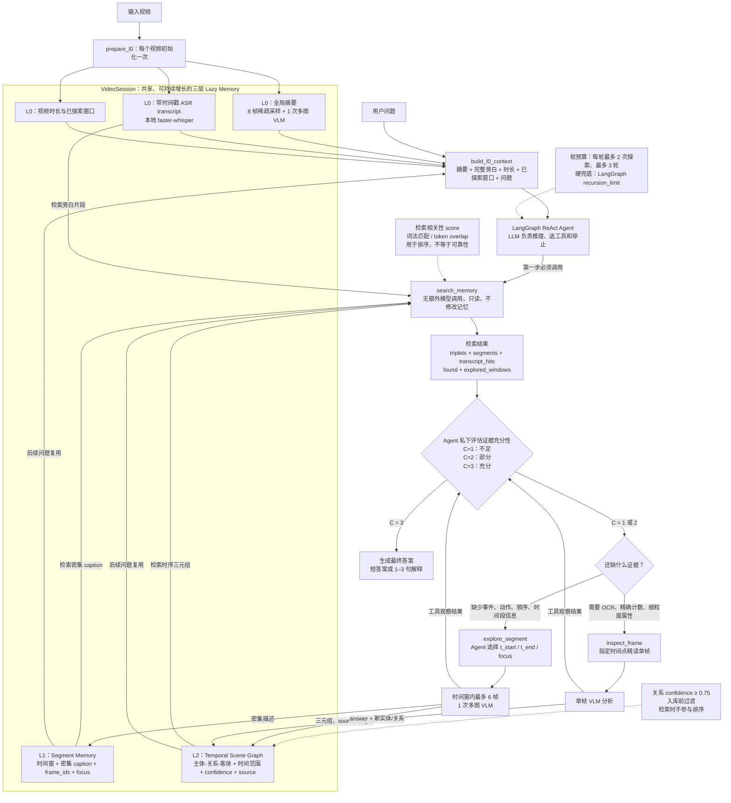

下面这张图按代码中的真实数据流绘制，并且把控制面、记忆层和感知工具分开了。



## 一、Agent 的总体架构

这个项目的 v2 架构可以概括成四部分：

1. **LangGraph ReAct Agent：控制面**
2. **VideoSession：共享状态和记忆面**
3. **三种工具：检索与感知执行面**
4. **LLM/VLM/ASR：模型能力层**

核心不是简单地“让大模型调用几个工具”，而是：

> 让 LLM 根据当前证据是否足以回答问题，动态决定是否分配更多视觉感知预算。

`build_agent_v2` 将三个工具绑定到同一个 `VideoSession`：

- `search_memory`
- `explore_segment`
- `inspect_frame`

然后通过 LangChain 的 `create_agent` 构建由 LangGraph 执行的 ReAct 循环，见 [react_agent.py](/Users/cjzh/Video-agent/src/agents/react_agent.py:342)。

Agent 每次可以做两类动作：

- 输出结构化 `tool_call`，LangGraph 执行工具并把结果追加回消息历史；
- 输出普通文本，LangGraph 将其视为最终答案并停止。

所以“置信度驱动”在运行时的可观察表现是：

```text
证据不足 → LLM 继续输出工具调用
证据充分 → LLM 输出最终文本并停止
```

当前并没有一个独立的 Python `ConfidenceController`。控制策略主要存在于系统提示词和 LLM 的工具选择中。

---

# 二、三层 Lazy Memory

## 1. L0：低成本的全局记忆

每个视频创建会话时，`prepare_l0` 做一次轻量初始化：

- 均匀抽取 8 帧；
- 调用一次多图 VLM，生成 3～5 句全局摘要；
- 本地运行 ASR，生成带时间戳的 transcript；
- 读取视频总时长。

代码在 [react_agent.py](/Users/cjzh/Video-agent/src/agents/react_agent.py:276)。

L0 的作用不是精确回答所有问题，而是提供：

- 视频大致主题；
- 人物和场景；
- 主要活动及粗略顺序；
- 显著画面文字；
- 旁白内容及其时间位置；
- 后续探索时间窗的线索。

需要注意一个代码细节：

- 全局摘要直接放进 Agent 上下文；
- transcript 既完整放进上下文，也会被 `search_memory` 检索；
- `search_memory` 本身不会重新检索全局摘要。

`build_l0_context` 每次提问都会重新生成上下文，因此后续问题可以看到此前已经探索过的时间窗口，[react_agent.py](/Users/cjzh/Video-agent/src/agents/react_agent.py:323)。

## 2. L1：按需生成的 Segment Memory

L1 不是预处理阶段一次性生成，而是 Agent 发现证据不足时，通过 `explore_segment` 动态生成。

每个 Segment 保存：

- `segment_id`
- `t_start`、`t_end`
- 密集 caption
- 当时要寻找的 `question/focus`
- 该窗口使用的 `frame_ids`

数据结构见 [session.py](/Users/cjzh/Video-agent/src/memory/session.py:25)。

与 v1 只保存三元组相比，L1 保留了视觉模型看到的完整描述，包括：

- 动作顺序；
- 行为方式；
- 物体属性；
- 画面文字；
- 难以压缩成固定关系词的细节。

这解决了场景图作为有损表示的问题。

## 3. L2：时序场景图索引

L2 保存结构化三元组：

```text
主体 --[关系]--> 客体
t_start, t_end, confidence, source
```

例如，来自一个 Segment 的三元组会携带：

```text
source = "seg:seg_001"
```

这个 `source` 建立了从三元组到原始密集 caption 的溯源关系。

当 `search_memory` 命中某条三元组时，会解析它的 `seg:<id>`，把对应的完整 caption 一起返回。代码甚至把这种通过 provenance 拉回的 Segment 相关性提升为 `1.0`，见 [retriever.py](/Users/cjzh/Video-agent/src/scene_graph/retriever.py:362)。

因此，v2 中场景图的角色发生了变化：

> 场景图不再是答案本身，而是指向完整证据的时序索引。

可以类比为：

- 三元组是“目录条目”；
- Segment caption 是“原文证据”；
- transcript 是“语言模态证据”。

---

# 三、三种工具的设计

## 1. `search_memory`：低成本检索工具

这是每个问题必须先调用的工具。

### 输入

```json
{
  "question": "用户的自然语言问题"
}
```

### 输出

```json
{
  "triplets": [],
  "segments": [],
  "transcript_hits": [],
  "entity_summary": "",
  "explored_windows": [],
  "found": true
}
```

### 检索范围

它联合检索：

- L2 时序三元组；
- L1 Segment caption；
- L0 transcript。

具体实现见 [retriever.py](/Users/cjzh/Video-agent/src/scene_graph/retriever.py:336)。

### 为什么叫“free lookup”

这里的“free”不是整个问答零成本，而是说：

- 不调用 VLM；
- 不解码新视频帧；
- 不产生新的多模态 API 调用；
- 只在已有内存结构中进行 CPU 检索。

Agent 在调用工具前后依然需要 LLM 推理，因此仍然有语言模型 token 成本。

### 检索排序

三元组主要按照词法相关性打分：

- 查询词等于主体或客体：`+2.0`
- 查询词等于关系：`+1.5`
- 查询词是主体或客体的子串：`+0.5`
- 查询词是关系的子串：`+0.3`

L1 caption 和 transcript 使用查询 token 覆盖率：

\[
score=\frac{\text{命中的查询词数量}}{\text{查询词总数}}
\]

默认最多返回：

- 5 条三元组；
- 3 个 Segment；
- 4 条 transcript。

因此，`search_memory` 的 `score` 表示的是**相关性**，不是证据正确概率。

### 是否修改记忆

不修改。它是只读工具。

这使它适合作为默认第一步：先榨取已有信息，再决定是否承担视觉成本。

---

## 2. `explore_segment`：按需扩展记忆的核心工具

`explore_segment` 是 v2 的主要视觉感知工具。

### 输入

```json
{
  "t_start": 20,
  "t_end": 40,
  "focus": "需要寻找的具体证据"
}
```

时间窗和关注点由 Agent 自己选择，而不是写死在流水线中。

### 内部过程

工具会：

1. 将时间范围限制在有效视频区间；
2. 在窗口中最多均匀抽取 6 帧；
3. 调用一次多图 VLM；
4. 要求 VLM 同时输出：
   - 密集 caption；
   - 实体；
   - 关系；
   - 时间范围；
   - 关系置信度；
5. 执行实体去重和关系合并；
6. 将 caption 写入 L1；
7. 将通过过滤的三元组写入 L2；
8. 给三元组添加 `source="seg:<id>"`。

代码入口在 [segment_inspector.py](/Users/cjzh/Video-agent/src/tools/segment_inspector.py:49)，记忆写入逻辑在 [builder.py](/Users/cjzh/Video-agent/src/scene_graph/builder.py:599)。

### 输出

```json
{
  "segment_id": "seg_001",
  "t_start": 20,
  "t_end": 40,
  "caption": "该时间窗口的密集描述",
  "nodes_added": 4,
  "edges_added": 3,
  "explored_windows": [[20, 40]]
}
```

工具把 caption 直接返回给 Agent，所以本轮不一定必须再次执行 `search_memory`；LLM 可以先根据工具观察结果重新判断置信度。与此同时，数据已经写入 `VideoSession`，后续问题可以继续检索。

### 为什么它比“全片建图”更合理

因为问题决定了需要看的内容。

不同问题需要不同窗口：

- 问某个动作：看动作发生附近；
- 问事件先后：需要覆盖两个事件；
- 问持续时间：需要找到活动完整起止点；
- 问旁白原因：可能根本不需要看新帧。

因此，建图不再是预处理任务，而成为逐题推理中的 Agent 决策。

---

## 3. `inspect_frame`：单帧精读工具

这个工具用于 `explore_segment` 仍难以可靠解决的问题，例如：

- OCR；
- 精确计数；
- 小物体；
- 细粒度颜色或属性；
- 人脸或局部特征；
- 某个瞬间的空间关系。

### 输入

```json
{
  "timestamp": 34.5,
  "question": "需要在这一帧确认的细粒度问题"
}
```

工具优先寻找目标时间附近的缓存帧；如果没有，就按需从视频中提取单帧。

调用 VLM 后，除返回自然语言答案外，还会把新发现的实体和关系回写场景图。回写代码见 [frame_inspector.py](/Users/cjzh/Video-agent/src/tools/frame_inspector.py:191)。

这使 `inspect_frame` 不只是一次性问答工具，也是一种记忆增强工具。

### 与 `explore_segment` 的分工

| 工具 | 最适合的问题 | 粒度 | 是否扩展记忆 |
|---|---|---:|---:|
| `search_memory` | 已有证据是否能回答 | 已有三层记忆 | 否 |
| `explore_segment` | 事件、动作、顺序、时间范围 | 最多 6 帧的时间窗 | 是，写 L1 和 L2 |
| `inspect_frame` | OCR、计数、细粒度属性 | 单帧 | 是，主要写 L2 |

一个很好的工具设计原则是：

> 工具之间不是重复关系，而是按“成本—粒度”逐级升级：先检索，再看时间段，最后精读单帧。

---

# 四、置信度如何驱动工具编排

## 1. Agent 作答置信度

系统提示词要求 Agent 在拿到检索结果后，私下评估：

- `1`：证据不足；
- `2`：证据部分充分；
- `3`：证据充分。

代码见 [react_agent.py](/Users/cjzh/Video-agent/src/agents/react_agent.py:201)。

这里评估的不是“我感觉答案可能是什么”，而应该是：

> 当前摘要、旁白、检索结果和已探索画面，能否形成一条足以支撑答案的证据链？

置信度驱动的决策可以抽象成：

\[
C(q,E)=
\begin{cases}
3 & \text{证据足以支持答案}\\
2 & \text{存在相关证据，但缺关键环节}\\
1 & \text{几乎没有直接证据}
\end{cases}
\]

其中：

- \(q\) 是问题；
- \(E\) 是当前多模态证据集合。

策略为：

\[
\pi(q,E)=
\begin{cases}
Answer & C(q,E)=3\\
AcquireEvidence & C(q,E)<3
\end{cases}
\]

## 2. 三套容易混淆的信号

| 信号 | 取值 | 产生位置 | 作用 |
|---|---:|---|---|
| Agent 作答置信度 | 1、2、3 | LLM 私下判断 | 决定继续调用工具还是回答 |
| 三元组关系置信度 | 0～1 | VLM 抽取关系时生成 | 低于阈值的关系不进入图 |
| 检索相关性 `score` | 非固定范围 | retriever 词法匹配 | 决定哪些证据优先返回 |
| `found` | true/false | `search_memory` | 只表示有没有命中 |

目前的代码关系是：

```text
关系 confidence
    ↓ 入库过滤
可检索的证据池
    ↓ relevance score 排序
返回相关证据
    ↓ LLM 综合判断
Agent confidence 1–3
    ↓
继续探索或回答
```

三元组置信度没有直接参与检索排序，也没有通过公式聚合成 Agent 作答置信度。它只是：

- 在入库前过滤低置信度关系；
- 作为元数据随检索结果返回；
- 由 LLM 自行决定是否参考。

关系过滤阈值为 `0.75`，见 [config.py](/Users/cjzh/Video-agent/src/config.py:69) 和 [builder.py](/Users/cjzh/Video-agent/src/scene_graph/builder.py:656)。

---

# 五、具体的工具路由规则

系统提示词不只是给出 1～3 置信度，还加入了一些题型约束。

## 1. 旁白优先的问题

对于以下问题，transcript 被视为更权威的证据：

- 为什么；
- 怎么做；
- 视频里说了什么；
- 原因；
- 步骤；
- 语言描述的先后顺序。

因为这些信息可能根本没有可见的视觉表达。Agent 应优先阅读旁白，而不是盲目调用视觉工具。

## 2. 短视频第一次探索

如果视频短于约 60 秒，而且还没有探索任何窗口，提示词要求优先探索完整视频范围。

原因是短视频中选错局部窗口的风险可能比一次覆盖全片更大，而 `explore_segment` 仍只使用最多 6 帧。

## 3. 持续时间和顺序问题

如果要比较两个活动的持续时间，必须覆盖活动的完整时间范围。

假如某条关系的时间范围刚好贴着探索窗口边缘，例如：

```text
explored window: 20–40s
activity interval: 25–40s
```

不能直接认为活动在 40 秒结束，因为它可能只是超出了当前窗口。提示词要求扩大窗口后再比较。

## 4. 否定问题

系统明确规定：

> 记忆中没有某个事实，不等于视频里没有这个事实。

因为 L1/L2 是 Lazy Memory，只覆盖已经探索过的窗口。因此，对于“有没有”“是否没有”这类问题，不能因为 `found=false` 就直接回答 `no`，必须先探索相关窗口验证。

## 5. 结构或全局推理问题

代码还保留了 `explore=False` 的 no-explore 变体，只向 Agent 提供 `search_memory`。

这是一个评测路由实验：部分全局结构或推理问题，如果只放大一个局部窗口，反而可能丢失整体信息。对应提示词在 [react_agent.py](/Users/cjzh/Video-agent/src/agents/react_agent.py:243)。

需要准确表述：

- CLI 和 API 的真实主路径默认使用完整 v2 工具集；
- `explore=False` 主要是 benchmark 中的题型路由实验；
- 不是所有产品问题都会预先分类后禁用探索。

---

# 六、循环预算：软约束与硬约束

提示词规定：

- 每轮最多执行 2 次 `explore_segment`；
- 最多 3 轮；
- 置信度达到 3 就提前停止；
- 预算耗尽后输出当前最有证据支持的答案；
- 仍然无法回答时说明缺少什么，而不是猜测。

但代码中没有维护：

```python
state.round_count
state.explore_count
state.confidence
```

因此，这些是 LLM 需要遵循的**软约束**。

真正的硬兜底是 LangGraph 的 `recursion_limit`：

```python
v2_recursion_limit = max_iterations * 5 + 10
```

默认 `max_iterations=10`，因此总图步骤上限默认为 60。见 [react_agent.py](/Users/cjzh/Video-agent/src/agents/react_agent.py:75)。

所以当前架构准确描述为：

> 提示词负责细粒度探索策略，LangGraph 递归上限负责防止整个 Agent 工具循环无限执行。

---

# 七、共享状态和多轮复用

三个工具通过闭包绑定同一个 `VideoSession`，不需要在工具调用参数中来回传递完整场景图。

`VideoSession` 保存：

- 已缓存帧；
- 全局摘要；
- transcript；
- duration；
- L1 Segments；
- L2 Scene Graph；
- 已探索窗口。

在交互模式中：

- L0 只初始化一次；
- 同一个 Agent 和 Session 跨问题复用；
- 每次提问重新调用 `build_l0_context`；
- 前一题探索过的窗口可以服务后一题。

这段复用逻辑在 [main.py](/Users/cjzh/Video-agent/main.py:160)。

它带来两个收益：

1. 前面问题付出的视觉成本可以被后续问题摊薄；
2. 记忆会逐步从粗粒度变成与用户关注内容相关的细粒度表示。

但也存在风险：如果前面生成的 caption 或三元组有错误，错误可能进入长期会话记忆。因此 provenance、置信度过滤和后续冲突检测都很重要。

---

# 八、与 v1 固定流水线的区别

v1 的基本模式是：

```text
抽帧
→ 建完整场景图
→ 查询场景图
→ 必要时 inspect_frame
→ 回答
```

其问题是：

- 不管用户问什么，都要先承担全片建图成本；
- 场景图三元组成为唯一答案来源；
- OCR、属性、事件因果和描述性细节会在压缩成三元组时丢失；
- 视频通常只有少量问题时，预建成本难以摊薄。

v2 改成：

```text
L0 粗略理解
→ 检索已有记忆
→ 判断证据充分性
→ 不足才按需看某个窗口
→ 保留 caption，并用三元组做索引
→ 证据充分即停止
```

所以 v2 的三个核心变化是：

1. **从 eager perception 变成 lazy perception**
2. **从 graph-as-answer 变成 graph-as-index**
3. **从固定流水线变成置信度驱动的自适应工具编排**

项目文档报告，在 MMBench-Video 150 题、三次运行中，v2 得分为 `1.984±0.101`，同模态的 8 帧 VLM+transcript 基线为 `1.727±0.020`；同时 Frames/Q 为 `3.6`，基线固定为 `8.0`。这些是评测结果而不是代码本身的保证，见 [README.zh.md](/Users/cjzh/Video-agent/README.zh.md:53)。

---

# 九、工程层面值得在面试中提到的设计

## 1. 主路径一致

真实模式下：

- CLI 单问使用 `prepare_l0 + build_agent_v2`；
- CLI 交互模式使用同一条 v2 路径；
- FastAPI 服务也使用同一条 v2 路径；
- benchmark 同样调用 `build_agent_v2`。

CLI 入口见 [main.py](/Users/cjzh/Video-agent/main.py:108)，API 入口见 [app.py](/Users/cjzh/Video-agent/src/api/app.py:90)。

这意味着产品路径和评测路径共享核心架构，减少“评测代码与线上代码不一致”的问题。

## 2. 失败时不伪造证据

真实后端不可用时，工具返回明确错误，不会静默切换到伪造的视频内容。

尤其是 `inspect_frame`：

- 没有 API Key；
- 帧文件不存在；
- 无法提取目标帧；

都会返回错误或明确降级信息，而不会发明实体和关系。

这对视频问答很重要，因为伪造的工具观察一旦写入记忆，会污染后续所有答案。

## 3. 文本伪工具调用重试

部分模型可能输出：

```text
search_memory("...")
```

但没有真正通过 tool-calling interface 发起调用。

代码会识别这种“文本形式的伪调用”，重新提示模型：

- 要么真正调用工具；
- 要么直接给最终答案。

相关逻辑在 [react_agent.py](/Users/cjzh/Video-agent/src/agents/react_agent.py:87)。

## 4. 可观测的 reasoning trace

LangGraph 返回完整 message 列表，因此可以记录：

- Agent 发起了哪些工具调用；
- 每个工具的参数；
- 工具返回了什么；
- 最终答案；
- 工具调用次数；
- token 和视觉调用成本。

虽然当前没有显式记录每轮置信度，但工具轨迹已经支持定位：

- 是否过早停止；
- 是否选错时间窗；
- 检索是否漏召回；
- VLM 是否生成了错误 caption；
- 是否不必要地调用了昂贵工具。

---

# 十、当前架构的局限与改进方向

## 1. 置信度不可观测、不可校准

当前置信度存在于 LLM 私下推理中，没有写入 Agent State。

因此不能直接统计：

- `C=3` 时实际正确率是多少；
- `C=2` 是否真的应该探索；
- 哪些题型最容易过度自信；
- 不同 LLM 的置信度尺度是否一致。

更完整的实现可以让模型输出结构化决策：

```json
{
  "answerable": false,
  "confidence": 2,
  "evidence": ["transcript: 21-24s"],
  "missing_evidence": "目标动作后的结果还没有被观察",
  "next_action": "explore_segment",
  "next_window": [20, 40]
}
```

然后由 LangGraph 条件边硬控制：

```text
confidence == 3      → answer
confidence < 3       → tool router
explore_count >= max → best-effort answer
```

这样就能实现：

- 显式状态；
- 硬预算；
- 可审计；
- 可校准；
- 可基于验证集学习停止阈值。

## 2. 检索主要依赖词法匹配

当前 L1 和 transcript 使用 token overlap，L2 使用规则式词汇匹配。

它可能漏掉：

- 同义词；
- 指代；
- 语义改写；
- 跨模态表达差异；
- 复杂关系问题。

可以升级成混合检索：

\[
Score =
\alpha \cdot Lexical
+\beta \cdot Semantic
+\gamma \cdot Temporal
+\delta \cdot Reliability
\]

但不能简单地把三元组置信度乘进相关性分数，因为：

- 高可靠但完全不相关的证据不应该排前面；
- VLM 自报置信度本身可能没有校准；
- `inspect_frame` 写入的关系当前使用固定阈值值，和 VLM 关系置信度的语义并不完全一致。

## 3. “每轮两次、最多三轮”不是硬限制

目前只有总递归数是硬限制。可以在 Agent State 中增加：

```python
round_count
explore_count_this_round
total_explore_count
inspected_timestamps
```

同时避免：

- 重复探索相同窗口；
- 对同一帧反复精读；
- 超出预定视觉预算；
- 模型忘记自己已经探索过哪些位置。

## 4. 证据覆盖度比简单置信度更可靠

未来可以按题型建立可验证的充分性条件：

- OCR：是否获得可读文本；
- 计数：目标对象是否完整进入画面；
- 顺序：是否找到两个事件的时间范围；
- 持续时间：事件起点和终点是否都没有贴窗口边缘；
- 否定判断：候选时间范围是否已经被完整覆盖；
- 旁白问题：是否命中直接回答该问题的 transcript。

这比单纯让 LLM回答“我有多自信”更可控。

---

# 十一、可直接用于面试的讲述版本

:::writing{variant="standard" id="48317"}
这个项目的核心是一个基于 LangGraph ReAct 范式的视频问答 Agent。与传统方案先对整段视频做完整分析不同，我在 v2 中采用了三层 Lazy Memory 和置信度驱动的工具编排，让 Agent 根据具体问题决定是否需要继续投入视觉计算。

在视频级初始化阶段，系统先构建 L0 全局记忆：均匀抽取 8 帧，通过一次多图视觉模型调用生成全局摘要，同时在本地运行 ASR，得到带时间戳的旁白，并记录视频时长。这个阶段只提供视频主题、人物、场景和大致事件顺序，不追求覆盖所有细节。

每次收到问题后，系统会把全局摘要、完整旁白、视频时长以及已经探索过的窗口放进 Agent 上下文。Agent 的第一步被强制规定为调用 search_memory。这个工具不产生额外的视觉模型调用，而是在已有的三层记忆中进行联合检索：L0 的旁白、L1 的 Segment 密集描述和 L2 的时序场景图三元组。

检索完成后，Agent 会私下评估当前证据的充分性，分为三级：1 表示证据不足，2 表示有相关证据但缺少关键环节，3 表示证据足以支撑答案。如果达到 3，Agent 直接回答；如果低于 3，就继续获取证据。

对于缺少事件、动作、顺序或时间段信息的问题，Agent 会调用 explore_segment，自主选择开始时间、结束时间和关注点。该工具在时间窗口内最多均匀抽取 6 帧，通过一次多图 VLM 调用同时生成密集 caption 和实体关系三元组。Caption 被写入 L1，三元组被写入 L2，并携带 source=seg:id，因此后续检索命中三元组时，可以沿着 provenance 找回它对应的完整 caption。这里场景图的作用不是替代原始证据，而是作为指向多模态证据的时序索引。

如果问题需要读取画面文字、精确计数或者识别细粒度属性，Agent 会进一步调用 inspect_frame，在指定时间点进行单帧精读。这个工具的结果也会回写场景图，因此工具调用不仅解决当前问题，也会持续增强后续问题可复用的记忆。

项目中需要区分三种不同信号。第一种是 Agent 的 1 到 3 级作答置信度，它决定继续探索还是停止回答；第二种是 VLM 生成三元组时的 0 到 1 关系置信度，低于 0.75 的关系不会进入场景图；第三种是检索相关性分数，它通过词汇匹配或 token overlap 判断证据与问题是否相关。当前实现采用“先按关系置信度过滤，再按相关性检索，最后由 Agent 判断证据充分性”的方式。关系置信度会随检索结果返回，但没有直接参与检索排序，也没有通过公式聚合成 Agent 作答置信度。

置信度循环不是无限执行的。提示词规定每轮最多两次探索、最多三轮，并要求置信度达到 3 时立即停止；运行层面再通过 LangGraph recursion_limit 做硬兜底。还设置了证据约束，例如记忆里没有某个事实不代表视频里不存在，所以回答否定问题前必须先探索验证；对于为什么、怎么做、视频里说了什么等问题，则优先以旁白为证据。

与 v1 相比，v1 是先抽帧、全片建图、查图再回答，场景图既承担索引又承担答案表示，因此存在预处理成本高和三元组信息损失的问题。v2 把它改成先建立低成本全局记忆，再检索、判断置信度、按需探索，并保留完整 Segment caption。它把全量预计算转换成了逐题的动态预算分配，也把场景图从答案来源重新定位为证据索引。

当前实现也有明确边界。Agent 的 1 到 3 级置信度主要由提示词驱动，并没有作为显式状态记录，因此还不能直接做置信度校准；每轮探索次数也是软约束，真正的硬限制是总递归步数。下一步可以让模型结构化输出置信度、缺失证据和下一步动作，再通过 LangGraph 条件边实现硬路由和硬预算，同时根据题型定义可验证的证据充分性条件。这样可以进一步降低模型过度自信和提前停止的问题。
:::
