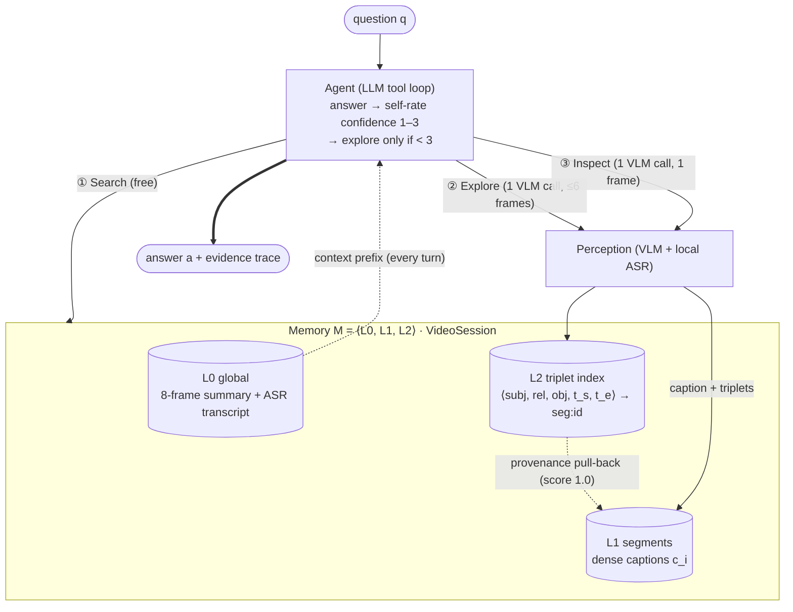

<!--
草稿状态：Ch.4 Method 完整可交初稿（2026-07-18）。
- 英文正文按 NTU EEE MSc dissertation 要求撰写；所有中文均在 HTML 注释内，渲染不可见，定稿时可整体剥离。
- 事实来源：源码（react_agent.py / session.py / builder.py / retriever.py / segment_inspector.py /
  frame_inspector.py / relation_vocab.py / asr.py / configs/default.yaml）；所有常数已逐一核对。
- 诚实性红线（写作时已遵守，审阅时请勿"顺手改强"）：
  1) exploration 预算（≤2/轮、≤3 轮）是 prompt 指令性约束，代码唯一硬上限是 recursion_limit=40 —— 正文用
     "instructed budget / enforced cap" 二分表述，不可写成 enforced budget；
  2) 实体跨批对齐阈值 0.85（difflib），不是 config 里预留未用的 0.9；
  3) L0 摘要为 8 帧（硬编码）；VL 模型 qwen-vl-plus。
- 图表资产：Fig. 4.1 = fig/ch4_architecture.svg（论文候选图）；正文内另嵌 mermaid 草图便于 GitHub 迭代讨论，
  终稿以 SVG 为准。Table 4.1 / 4.2 / 4.3（常数与出处）、Algorithm 4.1 已在文内。
- 修订轮（2026-07-18，代码逐段复核后）：事实修正（关系组 9 非 10、L0 前缀 per-question、时长 20s–6min、
  合并过滤语义、inspect 三级降级链——代码同步改为最近帧回退）；打分公式化、Algorithm [LLM]/[system] 行级
  标注、Λ 推导防御、滚动别名可复现性声明、引用占位（作者-年份，BibTeX 键见文末注释）。
-->

# Chapter 4 — Method: Lazy Three-Layer Memory and Confidence-Driven Orchestration

<!-- 注：本章主张一句话——场景图不是答案来源，而是"多模态证据的时序索引"；建图不是预处理，而是逐题的
agent 决策。全章围绕三条从 Ch.3 诊断反推出的设计需求展开。 -->

## 4.1 Overview

### 4.1.1 Problem setup and notation

We address long-video question answering: given a video $V$ of duration $T$ (roughly 20 s to
6 min in our evaluation setting; Ch. 5) and a natural-language question $q$, produce an answer $a$
that is *grounded in evidence extracted from $V$*. The system operates under a perception budget:
every look at the video — whether a set of sampled frames or a single frame — costs one call to a
vision–language model (VLM), and the central design question of this thesis is *where* those calls
should be spent. We accordingly measure the per-question perception cost as

$$C(q) \;=\; \#\textsc{Explore}(q) \;+\; \#\textsc{Inspect}(q)$$

VLM calls (equivalently, the frames those calls consume), on top of a once-per-video $L_0$
initialisation of a single VLM call; Ch. 5 reports both calls and frames per question under this
definition.

Throughout this chapter we use the following notation. The system maintains an external memory

$$\mathcal{M} \;=\; \langle L_0,\; L_1,\; L_2 \rangle,$$

whose three layers are defined in §4.2: a global layer $L_0$ (one-off, cheap), an evidence layer
$L_1$ of densely captioned segments $s_i$ (built on demand), and an index layer $L_2$ of
timestamped triplets $\tau$ with provenance links back to $L_1$. A segment is a tuple
$s_i = (\mathrm{id}_i,\, t_i^{s},\, t_i^{e},\, c_i,\, F_i)$ with time window $[t_i^s, t_i^e]$,
dense caption $c_i$, and sampled frames $F_i$; a triplet is a five-tuple
$\tau = \langle \mathit{subj},\, \mathit{rel},\, \mathit{obj},\, t^{s},\, t^{e} \rangle$ with a
provenance tag $\sigma(\tau)$ identifying the segment it was extracted from. The agent interacts
with $\mathcal{M}$ exclusively through three tools — $\textsc{Search}$ (free), $\textsc{Explore}$
(one VLM call over at most 6 frames), and $\textsc{Inspect}$ (one VLM call over a single frame) —
under a bounded interaction budget (§4.4). While answering one question the agent accumulates an
evidence set $E$ — the union of tool results returned so far — and maintains a self-assessed
confidence $\gamma \in \{1, 2, 3\}$ that $E$, together with the $L_0$ context, suffices to answer
$q$; both are given operational meaning in §4.4.

<!-- 注：预算符号 Λ=40 在 4.4 给出；这里只立"每次看视频=一次 VL call"的成本模型。 -->

### 4.1.2 Design requirements

Chapter 3 diagnosed two failure modes of the scene-graph-centric baseline (v1): triplets used as
the *answer source* form a lossy bottleneck (on-screen text, attribute detail and causal narration
are discarded at the "emit JSON triplets" step), and a *full upfront* graph build never amortises
at the observed load of roughly one question per video. Inverting these failures yields three
requirements that the present design satisfies by construction:

- **R1 — Memory must be multi-granular and built on demand.** Cheap global context is acquired
  once; expensive dense perception is a per-question decision, spent only where a question demands
  it (§4.2, §4.4).
- **R2 — Evidence must be preserved verbatim.** Structured representations may *locate* evidence
  but must never *replace* it: retrieval returns the original captions and narration text, not
  their compressed surrogates (§4.2.4).
- **R3 — Orchestration must be confidence-driven.** Whether to spend another perception call is
  decided at run time from the agent's own assessment of evidence sufficiency, under an explicit
  budget, rather than by a fixed pipeline (§4.4).

### 4.1.3 Architecture and question lifecycle

<!-- 注：Fig 4.1 的正式版是 fig/ch4_architecture.svg；下面的 mermaid 是迭代讨论用草图，语义与 SVG 一致。 -->

Figure 4.1 shows the architecture. A `VideoSession` object owns the memory $\mathcal{M}$ for one
video; the agent — a tool-calling LLM loop in the ReAct tradition (Yao et al., 2023) — holds no
state of its own, and every tool reads and writes the session (§4.5).

**Figure 4.1** — System architecture. Formal version: `fig/ch4_architecture.svg`.



The lifecycle of one question proceeds as follows. (1) At session creation, $L_0$ is initialised
once: a global summary from 8 uniformly sampled frames and a full narration transcript from local
ASR (§4.2.1). (2) When $q$ arrives, an $L_0$-derived context prefix is prepended to the prompt and
the agent must first call $\textsc{Search}$, a zero-cost joint lookup over all three layers
(§4.3.1). (3) The agent privately rates the sufficiency of the returned evidence on a 1–3 scale;
if insufficient, it selects a time window and calls $\textsc{Explore}$, which performs one VLM
call over at most 6 frames and *writes* a new dense caption into $L_1$ together with its indexed
triplets into $L_2$ (§4.3.2). (4) Questions demanding pixel-level detail (on-screen text, exact
counts) may use $\textsc{Inspect}$ on a single frame, whose findings are written back into $L_2$
(§4.3.3). (5) The loop terminates when confidence reaches 3 or the budget is spent, and the agent
answers strictly from accumulated evidence (§4.4). Because $\mathcal{M}$ persists across
questions, later questions on the same video frequently succeed at step (2) with no further
perception cost.

## 4.2 Lazy Three-Layer Memory

<!-- 注：本节按 L0→L1→L2 展开，4.2.4 收束到全章 thesis statement（graph=catalog, caption=evidence）。
Table 4.2 概览三层。 -->

**Table 4.2** — The three memory layers.

| Layer | Contents | Built when | Cost |
|---|---|---|---|
| $L_0$ global | 8-frame global summary; full timestamped ASR transcript; duration $T$ | once at session init (idempotent) | 1 VLM call + local ASR (no API cost) |
| $L_1$ evidence | segments $s_i$ with dense captions $c_i$ (3–5 sentences, on-screen text quoted) | on demand, per $\textsc{Explore}$ call | 1 VLM call per segment (≤6 frames) |
| $L_2$ index | entities; triplets $\tau$ with provenance $\sigma(\tau)$; closed 50-relation vocabulary | written together with $L_1$ (and by $\textsc{Inspect}$) | no extra call (joint output of the $L_1$ call) |

### 4.2.1 $L_0$: the global layer

$L_0$ answers the question "what is this video about, and what is said in it" at the lowest
possible cost, so that many questions never need dense perception at all.

**Global summary.** Eight frames are sampled uniformly over $[0, T]$ and passed to the VLM in a
single call with a factual-summary instruction (setting, people, main activities in rough order,
prominent on-screen text; 3–5 sentences). On VLM failure the summary degrades to the empty string
rather than to fabricated content — a system-wide *fail-loud* contract (§4.5).

**Narration transcript.** The full audio track is transcribed locally with faster-whisper — a
CTranslate2 reimplementation of Whisper (Radford et al., 2023) — using model size *small*, int8
quantisation on CPU, and voice-activity detection, yielding rows
$(t^{s}, t^{e}, \mathit{text})$. Transcription is disk-cached per video and incurs no API cost.
The transcript is rendered into the context as timestamped lines under a budget of 12,000
characters; when a long video exceeds the budget, the head and tail are kept (60%/40%) and the
middle elided. The head/tail policy is empirically motivated: procedural and conclusive content —
"what happened in the end", final steps, outcomes — concentrates at the ends of the track, and an
earlier truncate-the-tail policy was observed to lose exactly those questions.

<!-- 注：head/tail 60/40 的动机来自 Phase-14.1 失败分析（"transcript-not-used" 失败簇 3/10，
"final step lives at the end"），此处以经验动机一句带过，不展开 phase 编号；若评审要数字，
指向 progress.md §14.1。 -->

**Context injection.** Every question's prompt is prefixed with an $L_0$-derived context block:
duration, global summary, the (budgeted) transcript, and — once any exploration has happened —
the list of already-explored windows. The prefix is recomputed from the session for each incoming
question, so it reflects the memory state left by all earlier questions rather than any
conversation history (§4.5).

### 4.2.2 $L_1$: the evidence layer

$L_1$ is a growing set of *segments*. Each $\textsc{Explore}(t^{s}, t^{e}, \mathit{focus})$ call
samples at most 6 frames uniformly within the chosen window and issues **one** multi-image VLM
call that produces *both* outputs of the perception step jointly: a dense caption $c_i$ (3–5
sentences describing actions in order, enumerating visible objects, quoting any on-screen text
exactly) and the structured entities/relations that index it (§4.2.3). Producing caption and
triplets in one call is deliberate: relative to issuing separate captioning and extraction calls
it halves the perception cost of a segment, and it guarantees by construction that every triplet
has a caption to point back to.

The caption is the *evidence payload* of the layer — it is what retrieval ultimately returns to
the agent (R2). The segment also records its window, its focus string, and its frame identifiers,
which makes each piece of evidence auditable down to the frames it was derived from.

### 4.2.3 $L_2$: the temporal triplet index

$L_2$ contains an entity store and a triplet list. Entities carry a name, a type
(object/person/place/other), free-form attributes, and first/last-seen timestamps. Triplets are
five-tuples $\tau = \langle \mathit{subj}, \mathit{rel}, \mathit{obj}, t^{s}, t^{e} \rangle$ with
two metadata fields: a confidence score and a provenance tag $\sigma(\tau)$ — `seg:<id>` for
triplets extracted by $\textsc{Explore}$, `inspector` for those written back by
$\textsc{Inspect}$. Duplicate triplets are collapsed on the key
$(\mathit{subj}, \mathit{rel}, \mathit{obj}, t^{s}, t^{e})$.

**Closed relation vocabulary.** Relations are constrained to a closed set $\mathcal{R}$ of 50
verbs (e.g. *holding*, *walking_toward*, *talking_to*, *placed_on*), organised in 9 semantic
groups. The VLM prompt injects $\mathcal{R}$ with a hard instruction to choose labels only from
the list. A closed vocabulary trades recall on long-tail relations for index consistency — the
same physical relation always receives the same label, which keyword retrieval (§4.3.1) depends
on.

**Entity-name canonicalisation (three defences).** The same person or object must map to one node
across independently processed segments; naming drift would fragment the index. Three defences
apply in order of increasing cost:

1. *Prevention at generation time*: the extraction prompt includes a `[Known entities]` block
   listing up to 20 existing graph entities with the instruction to reuse their exact names —
   drift that never happens costs nothing to repair.
2. *In-batch deduplication*: within one extraction batch, entities are canonicalised on the key
   (lower-cased label, type), merging attributes and widening first/last-seen spans.
3. *Cross-batch alignment*: new labels are matched against the existing graph by string
   similarity (difflib ratio $\geq 0.85$, same type) and merged into the existing node, with the
   rename propagated to all relations in the batch.

**Temporal merging.** Relations that share $(\mathit{subj}, \mathit{rel}, \mathit{obj})$ and whose
intervals are within a 3.0 s gap are merged into one triplet (interval union, confidence maximum);
after merging, *all* edges with confidence below 0.75 are discarded (a missing confidence defaults
to 0.75 and is therefore retained). This keeps the index compact under continuous
activity — "person holding cup" observed on adjacent frames becomes one interval, not a triplet
per frame.

### 4.2.4 The provenance principle: the graph is a catalogue, not the answer

<!-- 注：全章 thesis statement。v1 的教训（三元组当答案来源=有损瓶颈）在 Ch.3；这里只写 v2 的立场与机制。 -->

$L_2$ exists to *locate* evidence, never to *be* the evidence. Mechanically: when retrieval
matches a triplet $\tau$ with $\sigma(\tau) = \texttt{seg:}i$, the parent segment's full caption
$c_i$ is forced into the result set at maximum relevance (score 1.0), regardless of whether the
caption itself matched the query. The structured fact serves as a timestamped pointer; what the
agent actually reads is the original dense description (and, through $L_0$, the narration around
that window). This single mechanism is the difference between v2 and the failed v1 design: both
build scene graphs, but v1 answered *from* the graph while v2 answers *through* it. The
information lost by compressing perception into $\langle \mathit{subj}, \mathit{rel},
\mathit{obj}\rangle$ tuples is recovered at retrieval time by construction.

## 4.3 The Memory Interface: Three Tools

<!-- 注：工具即"记忆的读写接口"；Table 4.1 是本节主表。search 的评分公式细节放正文，权重/top-k 全部来自
retriever.py 实测值。 -->

The agent never touches frames, files or the graph directly; it acts through three tools that
read or grow $\mathcal{M}$. Table 4.1 summarises their contracts.

**Table 4.1** — Tool contracts.

| Tool | Input | Returns | Cost | Writes |
|---|---|---|---|---|
| $\textsc{Search}$ | question text | matched triplets, segment captions, transcript lines, entity summary, explored windows | **free** (no API call) | — |
| $\textsc{Explore}$ | window $[t^{s}, t^{e}]$, focus | new segment id, caption, graph deltas, updated explored windows | 1 VLM call (≤6 frames) | $L_1$ + $L_2$ |
| $\textsc{Inspect}$ | timestamp, sub-question | pixel-level answer, entities/relations found | 1 VLM call (1 frame) | $L_2$ |

### 4.3.1 $\textsc{Search}$: free joint retrieval

$\textsc{Search}(q)$ performs keyword retrieval jointly over all three layers. Query and memory
text are tokenised identically: lower-cased, split on alphanumerics, stop-words removed, and each
token lemmatised against WordNet (Miller, 1995; via NLTK, Bird et al., 2009) — verb reading
first, then noun — so that surface variants match ("cooking" ≈ "cooks" ≈ "cook"). When the
WordNet data is unavailable (fully offline deployments), lemmatisation degrades to a lightweight
suffix-stripping stemmer; all reported experiments used the WordNet path.

- **Over $L_2$** (top 5, minimum score 0.3): a triplet is scored by summed keyword weights

  $$\mathrm{score}(\tau, q) \;=\; \sum_{t \,\in\, \mathrm{tok}(q)} w(t, \tau), \qquad
  w(t, \tau) \;=\; \begin{cases}
  2.0 & t = \mathit{subj} \ \text{or}\ t = \mathit{obj} \\
  1.5 & t = \mathit{rel} \\
  0.5 & t \sqsubset \mathit{subj} \ \text{or}\ t \sqsubset \mathit{obj} \\
  0.3 & t \sqsubset \mathit{rel} \\
  0 & \text{otherwise,}
  \end{cases}$$

  where $\sqsubset$ denotes proper substring containment and the first matching case applies.
  Temporal phrases in the question additionally filter by time: "at the beginning/first"
  restricts to the first 20% of $[0,T]$, "at the end/last" to the final 20%, and an explicit
  second/minute reference to a ±3 s (±5 s) neighbourhood.
- **Over $L_1$** (top 3): captions score by query-token coverage
  $\mathrm{cov}(c_i, q) = |\mathrm{tok}(q) \cap \mathrm{tok}(c_i)| \,/\, |\mathrm{tok}(q)|$,
  plus the provenance pull-back of §4.2.4.
- **Over $L_0$** (top 4): each transcript line scores by the same coverage measure
  $\mathrm{cov}(\cdot, q)$.

A minimum score of 0.15 filters segment and transcript hits. The result also reports the current
explored windows, so the agent can reason about *where memory has not looked yet* — the basis of
the grounding rule in §4.4.3. Because $\textsc{Search}$ is free, the orchestration policy can
mandate it unconditionally as the first action of every question.

### 4.3.2 $\textsc{Explore}$: on-demand dense perception

$\textsc{Explore}$ is the only operation that grows the evidence base, implementing R1's "build
on demand". The agent chooses the window itself — guided by the transcript timestamps, the
question's temporal cues, and the gaps in explored windows — which is precisely what
distinguishes *guided* sampling from the uniform sampling of direct-VLM baselines (Ch.5 quantifies
this difference). The tool contract advises windows of 10–30 s; a degenerate window below 0.5 s
falls back to a single frame.

### 4.3.3 $\textsc{Inspect}$: single-frame pixel reading

$\textsc{Inspect}(t, q')$ answers a focused sub-question on the single frame nearest to $t$.
Frame selection degrades in three stages: a cached frame within a 2 s tolerance is preferred;
failing that, the frame is extracted from the video on demand; and if extraction itself fails
(e.g. the source file is no longer accessible), the tool falls back to the temporally nearest
cached frame regardless of tolerance, disclosing the timestamp actually used in its result.
It exists because
some evidence — exact on-screen wording, small object counts — survives neither summarisation nor
6-frame segment captioning. Entities and relations discovered during inspection are written back
into $L_2$ (provenance `inspector`, confidence 0.75), so pixel-level findings become retrievable
by later questions. If the frame cannot be read or the backend is unavailable, the tool returns
an explicit error rather than a guess (§4.5).

## 4.4 Confidence-Driven Orchestration

<!-- 注：4.4.2 是诚实性红线所在：instructed budget（prompt 指令）vs enforced cap（recursion_limit=40）。
Algorithm 4.1 里也用注释标出这一区分。 -->

### 4.4.1 The loop

The orchestration policy is stated to the agent as a procedure and realised as a tool-calling LLM
loop (Algorithm 4.1). The agent must open with $\textsc{Search}$; it then privately rates the
sufficiency of available evidence on a three-point scale — 1 (insufficient), 2 (partial), 3
(sufficient) — and, while below 3, gathers evidence with $\textsc{Explore}$ under an instructed
budget of at most 2 explorations per round and 3 rounds in total. The loop stops as soon as
confidence reaches 3 or the budget is spent, and the agent must then give its best *supported*
answer — or state what evidence is missing, rather than guess.

**Algorithm 4.1** — Confidence-driven answering (one question).

```text
Input:  question q, session memory M = ⟨L0, L1, L2⟩
Output: answer a grounded in M

 1:  E ← Search(q)                        ▷ [system] mandatory first action; free
 2:  for round r = 1..3 do                ▷ instructed budget (see §4.4.2)
 3:      γ ← self-rate confidence of (E, L0-context) ∈ {1, 2, 3}    ▷ [LLM]
 4:      if γ = 3 then break
 5:      j ← 0
 6:      while γ < 3 and j < 2 do         ▷ up to 2 explorations per round
 7:          [t_s, t_e] ← choose window   ▷ [LLM] transcript cues, temporal
                                          ▷ phrases, gaps in explored windows
 8:          E ← E ∪ Explore(t_s, t_e, focus)   ▷ [system] writes L1 + L2
 9:          γ ← re-rate confidence on the new evidence             ▷ [LLM]
10:          j ← j + 1
11:      (optional) E ← E ∪ Inspect(t, q′)      ▷ [LLM] pixel-level detail
12:  a ← answer from E and L0-context only      ▷ grounding rules, §4.4.3
     ▷ [system] the whole loop runs under an enforced recursion cap Λ = 5K+10 = 40
     ▷ lines tagged [LLM] are model decisions instructed by the system prompt;
     ▷ lines tagged [system] are enforced by the orchestration code
```

### 4.4.2 Instructed budget versus enforced cap

The budget in Algorithm 4.1 (lines 2 and 6) is *instructed*: it is part of the system prompt, and
the model is trusted to follow it. It is not enforced by a counter in code. The *enforced*
bound is the orchestration framework's recursion limit $\Lambda = 5K + 10 = 40$ graph steps,
where $K = 6$ is the framework-level iteration allowance carried in the configuration — a
quantity distinct from, and deliberately looser than, the three instructed rounds. The factor
five is a heuristic per-round upper bound (one model call, up to two tool invocations and their
returns) and the constant term adds headroom for the initial and final exchanges; $\Lambda$ is
intentionally generous, because the tight constraint is meant to be the instructed budget, not
the cap. In the runs=3 benchmark campaign (Ch.5), no question exhausted
$\Lambda$, and observed behaviour stayed within the instructed budget (mean 1.7 tool calls and
3.6 frames per question); we nevertheless report the budget as instructed rather than enforced,
because that is what the implementation guarantees.

<!-- 注：3.6 帧/1.7 tool calls 是 runs=3 权威口径（benchmark_mmbv_final.md 报表）；此处引用作为
"instructed budget 实际被遵守"的证据，不改写成硬约束。 -->

### 4.4.3 Grounding rules

Three rules connect confidence to *evidence* rather than to the model's parametric knowledge:

1. **Absence is not "no".** Memory covers only explored windows; failing to find a fact in
   $\mathcal{M}$ is not evidence of its absence in $V$. Before answering "no", the agent must
   explore the relevant window. This rule is the mechanism behind the hallucination-resistance
   results of Ch.5: fabricating an answer about unexplored content is procedurally disallowed.
2. **The transcript is authoritative for narration.** Questions about reasons, methods, spoken
   content or step order are answered from ASR text with visual confirmation, not from visual
   inference alone.
3. **No parametric answers.** The final answer must derive from retrieved or newly gathered
   evidence and the $L_0$ context; if the budget expires with insufficient evidence, the agent
   states what is missing.

Two auxiliary window-selection heuristics are instructed alongside: a short video ($\lesssim$60 s)
with nothing explored should be explored in full first; and duration or order comparisons require
the complete extent of the events involved — if a fact's interval touches the edge of an explored
window, the window is widened before concluding.

### 4.4.4 Answer modes and robustness

The same agent runs in two answer modes: a benchmark mode constrained to short answers (single
word or phrase; exact "yes"/"no") and a product mode producing 1–3 sentences with timestamps.
Two robustness mechanisms wrap the loop. First, small open-weight models occasionally emit a
tool call as plain text instead of a structured call; a pattern detector catches such
"pseudo-calls" on the final message and re-asks once with a corrective instruction. Second, VLM
JSON output is parsed with three-level tolerance (direct parse; outermost-braces extraction;
bracket-depth array salvage for the entity/relation lists), recovering the caption from free text
when structure is mangled. Failures that survive all defences degrade loudly — empty results and
explicit error payloads — never silently into fabricated content.

## 4.5 Implementation Notes

<!-- 注：按大纲要求"半页到一页"，工程细节点到为止，展开留给附录 C。 -->

The agent is built on LangChain's `create_agent` (LangGraph runtime; Chase, 2022) with the tool
set of Table 4.1; the backbone LLM is Qwen (the DashScope `qwen-plus-latest` alias in all
reported experiments; a local vLLM backend is interface-compatible), and the VLM is
`qwen-vl-plus`, with images resized to a 1280 px longest edge. Both are hosted models behind
rolling aliases that cannot be pinned to a fixed snapshot; all experiments were run within a
single access window (June–July 2026), and this limitation is revisited among the threats to
validity in Ch. 5. All durable state lives in the `VideoSession` — the LangGraph message list
is not reused across questions; each question starts a fresh conversation whose only continuity
is the session memory itself. This externalisation keeps prompt length constant in the number of
questions, makes memory growth explicit (only $\textsc{Explore}$/$\textsc{Inspect}$ write), and
gives multi-turn reuse for free: consecutive questions about neighbouring content typically
resolve at $\textsc{Search}$ time with zero perception cost.

Reliability follows a *fail-loud* contract used throughout: mock/offline paths are visually
labelled and never fabricate domain data; real-path failures return explicit error markers
(degrading, e.g., to a missing summary or an empty transcript) instead of synthetic evidence that
could contaminate answers or evaluation. All token and call counts reported in Ch.5 come from a
thread-safe usage ledger recording the API-reported usage of every call — no estimates. VLM calls
carry six retries with a 90 s timeout; the ASR transcript is disk-cached per video and reused
across runs and sessions.

Table 4.3 consolidates every constant used in this chapter, with its provenance: *hard-coded*
(fixed in source), *config default* (exposed in the layered configuration but left at its
default), or *prompt-instructed* (stated to the model, not enforced in code). All values were
frozen before the evaluation campaign reported in Ch. 5; none were tuned against the benchmark
after that point.

**Table 4.3** — Constants and hyperparameters (verified against the implementation).

| Constant | Value | Provenance |
|---|---|---|
| $L_0$ summary frames | 8, uniform | hard-coded |
| ASR model | faster-whisper *small*, int8, VAD | hard-coded |
| Transcript context budget | 12,000 chars (60% head / 40% tail) | hard-coded |
| $\textsc{Explore}$ frames per window | ≤ 6, uniform | hard-coded |
| Exploration budget | ≤ 2 per round, ≤ 3 rounds | prompt-instructed |
| $\textsc{Inspect}$ frame tolerance | 2.0 s | config default |
| $\textsc{Inspect}$ write-back confidence | 0.75 | config default |
| Relation vocabulary | 50 verbs / 9 groups | hard-coded |
| `[Known entities]` prompt block | ≤ 20 entities | hard-coded |
| Cross-batch name alignment | difflib ratio ≥ 0.85, same type | hard-coded¹ |
| Temporal merge gap | ≤ 3.0 s | config default |
| Edge confidence filter | ≥ 0.75 | config default |
| $\textsc{Search}$ weights $w$ | 2.0 / 1.5 / 0.5 / 0.3 | hard-coded |
| $\textsc{Search}$ top-$k$ ($L_2$/$L_1$/$L_0$) | 5 / 3 / 4 | hard-coded |
| $\textsc{Search}$ minimum scores | 0.3 (triplets); 0.15 (captions, transcript) | hard-coded |
| Provenance pull-back score | 1.0 | hard-coded |
| Time-phrase filters | first/last 20%; ±3 s (±5 s for minutes) | hard-coded |
| Iteration allowance $K$ / cap $\Lambda$ | 6 / 40 (= 5K+10) | config default / derived |
| VLM retries / timeout | 6 / 90 s | hard-coded |
| Image longest edge | 1280 px | config default |

<small>¹ A `dedup_threshold: 0.9` field exists in the configuration but is reserved for a future
embedding-based deduplication and is not wired to this path; the operative value is 0.85.</small>

<!--
参考文献占位（正文作者-年份对应的 BibTeX 键，转 LaTeX 时替换为 \cite）：
  Radford et al., 2023  → radford2023whisper   (Whisper; faster-whisper/CTranslate2 实现另加软件引用)
  Yao et al., 2023      → yao2023react         (ReAct)
  Miller, 1995          → miller1995wordnet    (WordNet)
  Bird et al., 2009     → bird2009nltk         (NLTK)
  Chase, 2022           → langchain2022        (LangChain/LangGraph, 软件引用)
常数速查表已升格为正文 Table 4.3（含出处列），本注释不再重复数值。
-->
